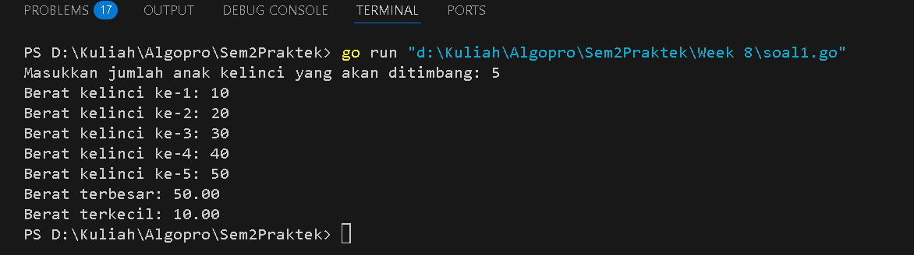
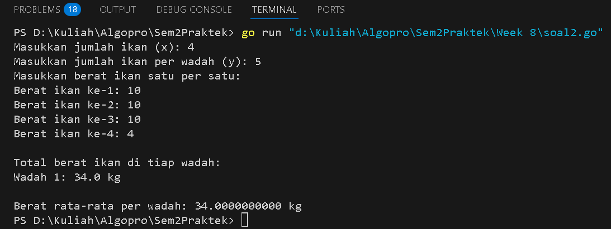
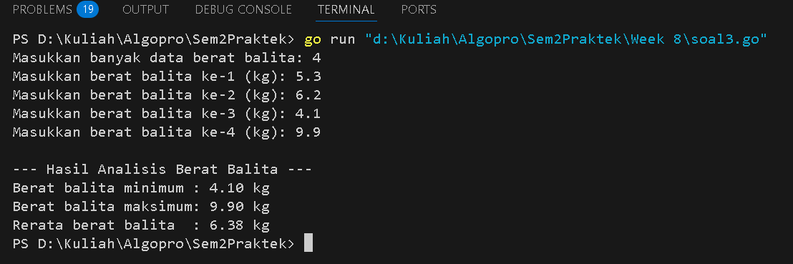

<h1 align="center">Laporan Praktikum Modul 10</h1>
<p align="center">Balawan Satria Lhaksana Putra Mazzimo - 103112430004</p>


## Dasar Teori
Pencarian nilai ekstrem (nilai maksimum dan minimum) merupakan salah satu bentuk algoritma pencarian sederhana yang sangat umum digunakan dalam pemrograman. Konsep utamanya adalah memeriksa setiap elemen dalam sebuah himpunan data secara sekuensial untuk menentukan nilai tertinggi (maksimum) dan terendah (minimum). Langkah awal pencarian dilakukan dengan mengasumsikan elemen pertama sebagai nilai awal ekstrem, kemudian dibandingkan dengan elemen berikutnya satu per satu. Jika ditemukan nilai yang lebih besar (untuk maksimum) atau lebih kecil (untuk minimum), maka nilai ekstrem diperbarui.

#### Soal 1

> Sebuah program digunakan untuk mendata berat anak kelinci yang akan dijual ke pasar. Program ini menggunakan array dengan kapasitas 1000 untuk menampung data berat anak kelinci yang akan dijual. Masukan terdiri dari sekumpulan bilangan, yang mana bilangan pertama adalah bilangan bulat N yang menyatakan banyaknya anak kelinci yang akan ditimbang beratnya. Selanjutnya N bilangan riil berikutnya adalah berat dari anak kelinci yang akan dijual. Keluaran terdiri dari dua buah bilangan riil yang menyatakan berat kelinci terkecil dan terbesar.

```go
package main

import "fmt"

type arrKelinci []float64

// Fungsi untuk mengisi data berat kelinci
func dataKelinci(n int) arrKelinci {
	var (
		berat  float64
		array  arrKelinci
	)

	for i := 0; i < n; i++ {
		fmt.Printf("Berat kelinci ke-%d: ", i+1)
		fmt.Scan(&berat)
		array = append(array, berat)
	}
	return array
}

// Fungsi untuk mencari berat terbesar dan terkecil
func sortirKelinci(array arrKelinci, n int) (float64, float64) {
	max := array[0]
	min := array[0]

	for i := 1; i < n; i++ {
		if array[i] > max {
			max = array[i]
		}
		if array[i] < min {
			min = array[i]
		}
	}
	return max, min
}

func main() {
	var n int
	fmt.Print("Masukkan jumlah anak kelinci yang akan ditimbang: ")
	fmt.Scan(&n)

	if n > 1000 {
		fmt.Println("Kapasitas maksimal adalah 1000 data.")
	} else {
		data := dataKelinci(n)
		max, min := sortirKelinci(data, n)
		fmt.Printf("Berat terbesar: %.2f\n", max)
		fmt.Printf("Berat terkecil: %.2f\n", min)
	}
}
```
Hasil :

**Deskripsi :**
Program ini bertujuan untuk mendata dan menganalisis berat anak kelinci yang akan dijual ke pasar dengan menentukan nilai berat terbesar dan terkecil dari data yang diinputkan oleh pengguna. Program menggunakan slice bertipe `float64` untuk menampung data berat, dengan jumlah maksimum sebanyak 1000 data. Pengguna diminta memasukkan jumlah anak kelinci terlebih dahulu, kemudian memasukkan berat masing-masing kelinci satu per satu melalui fungsi `dataKelinci`. Semua data yang dimasukkan akan disimpan ke dalam array dinamis.

Setelah seluruh data terkumpul, program akan memanggil fungsi `sortirKelinci` untuk mencari nilai berat terkecil dan terbesar. Proses pencarian ini dilakukan secara iteratif dengan membandingkan setiap elemen dalam array dan memperbarui nilai ekstrem bila ditemukan nilai yang lebih kecil atau lebih besar. Hasil akhir yang ditampilkan berupa berat kelinci terbesar dan terkecil dalam format dua angka di belakang koma. Program ini merupakan implementasi langsung dari konsep pencarian nilai ekstrem dalam struktur data array sesuai materi pada modul algoritma dan pemrograman.
#### Soal 2

>Sebuah program digunakan untuk menentukan tarif ikan yang akan dijual ke pasar. Program ini menggunakan array dengan kapasitas 1000 untuk menampung data berat ikan yang akan dijual. Masukan terdiri dari dua baris, yang mana baris pertama terdiri dari dua bilangan bulat x dan y. Bilangan x menyatakan banyaknya ikan yang akan dijual, sedangkan y adalah banyaknya ikan yang akan dimasukan ke dalam wadah. Baris kedua terdiri dari sejumlah x bilangan riil yang menyatakan banyaknya ikan yang akan dijual. Keluaran terdiri dari dua baris. Baris pertama adalah kumpulan bilangan riil yang menyatakan total berat ikan di setiap wadah (jumlah wadah tergantung pada nilai x dan y, urutan ikan yang dimasukan ke dalam wadah sesuai urutan pada masukan baris ke-2). Baris kedua adalah sebuah bilangan riil yang menyatakan berat rata-rata ikan di setiap wadah.

```go
package main

import "fmt"

type arrIkan []float64

func dataIkan(x int) arrIkan {
	var (
		ikan  float64
		array arrIkan
	)

	fmt.Println("Masukkan berat ikan satu per satu:")
	for i := 0; i < x; i++ {
		fmt.Printf("Berat ikan ke-%d: ", i+1)
		fmt.Scan(&ikan)
		array = append(array, ikan)
	}
	return array
}

func kelompokIkan(data arrIkan, x, y int) ([]float64, float64) {
	var (
		totalWadah        []float64
		totalSemua, total float64
		jumlahWadah       int
	)

	for i := 0; i < x; i += y {
		total = 0
		for j := i; j < i+y && j < x; j++ {
			total += data[j]
		}
		totalWadah = append(totalWadah, total)
		totalSemua += total
		jumlahWadah++
	}

	rataRata := totalSemua / float64(jumlahWadah)
	return totalWadah, rataRata
}

func hasil(wadah []float64, rataRata float64) {
	fmt.Println("\nTotal berat ikan di tiap wadah:")
	for i := 0; i < len(wadah); i++ {
		fmt.Printf("Wadah %d: %.1f kg\n", i+1, wadah[i])
	}
	fmt.Printf("\nBerat rata-rata per wadah: %.10f kg\n", rataRata)
}

func main() {
	var x, y int
	fmt.Print("Masukkan jumlah ikan (x): ")
	fmt.Scan(&x)
	fmt.Print("Masukkan jumlah ikan per wadah (y): ")
	fmt.Scan(&y)

	if x > 1000 {
		fmt.Println("Kapasitas maksimal adalah 1000 data")
	} else {
		data := dataIkan(x)
		totalWadah, rata := kelompokIkan(data, x, y)
		hasil(totalWadah, rata)
	}
}
```
Hasil :

**Deskripsi :**
Program ini digunakan untuk menerima input berat ikan sebanyak jumlah yang ditentukan oleh pengguna. Setelah itu, program akan mengelompokkan ikan-ikan tersebut ke dalam beberapa wadah, di mana setiap wadah berisi sejumlah ikan sesuai dengan jumlah per wadah yang dimasukkan. Selanjutnya, program menghitung total berat ikan di setiap wadah dan menampilkannya satu per satu. Selain itu, program juga menghitung berat rata-rata per wadah dan menampilkannya dengan presisi tinggi. Program ini membatasi jumlah maksimal data ikan hingga 1000 dan akan menolak input jika melebihi batas tersebut.
#### Soal 3

>Pos Pelayanan Terpadu (posyandu) sebagai tempat pelayanan kesehatan perlu mencatat data berat balita (dalam kg). Petugas akan memasukkan data tersebut ke dalam array. Dari data yang diperoleh akan dicari berat balita terkecil, terbesar, dan reratanya. 

```go
package main

import "fmt"

type arrBalita []float64

func hitungMinMax(arrBerat arrBalita, bMin, bMax *float64) {
	*bMin = arrBerat[0]
	*bMax = arrBerat[0]

	for i := 1; i < len(arrBerat); i++ {
		if arrBerat[i] < *bMin {
			*bMin = arrBerat[i]
		}
		if arrBerat[i] > *bMax {
			*bMax = arrBerat[i]
		}
	}
}

func rerata(arrBerat arrBalita) float64 {
	var total float64
	for i := 0; i < len(arrBerat); i++ {
		total += arrBerat[i]
	}
	return total / float64(len(arrBerat))
}

func main() {
	var (
		n        int
		array    arrBalita
		berat    float64
		min, max float64
	)

	fmt.Print("Masukkan banyak data berat balita: ")
	fmt.Scan(&n)

	if n <= 0 {
		fmt.Println("Jumlah data harus lebih dari 0!")
		return
	}

	for i := 0; i < n; i++ {
		for {
			fmt.Printf("Masukkan berat balita ke-%d (kg): ", i+1)
			fmt.Scan(&berat)
			if berat > 0 {
				break
			}
			fmt.Println("Berat harus lebih dari 0 kg. Silakan masukkan kembali.")
		}
		array = append(array, berat)
	}

	hitungMinMax(array, &min, &max)
	avg := rerata(array)

	fmt.Println("\n--- Hasil Analisis Berat Balita ---")
	fmt.Printf("Berat balita minimum : %.2f kg\n", min)
	fmt.Printf("Berat balita maksimum: %.2f kg\n", max)
	fmt.Printf("Rerata berat balita  : %.2f kg\n", avg)
}
```
Hasil :

Deskripsi :
Program ini digunakan untuk membantu petugas Posyandu mencatat dan menganalisis data berat badan balita. Petugas akan terlebih dahulu menentukan jumlah data yang akan dimasukkan, kemudian memasukkan berat badan masing-masing balita satu per satu.
Program akan memproses data tersebut untuk menghitung:
- **Berat badan minimum** (balita paling ringan)
- **Berat badan maksimum** (balita paling berat)
- **Rerata berat badan** dari seluruh balita yang tercatat
Selama proses input, program juga memvalidasi bahwa setiap berat balita harus bernilai lebih dari 0 kg. Setelah semua data dimasukkan, program menampilkan hasil analisis dalam format yang rapi dan informatif. Program ini membantu pemantauan status gizi dan tumbuh kembang anak-anak di lingkungan Posyandu secara sederhana namun efektif.
