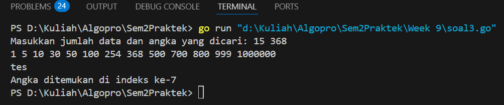

<h1 align="center">Laporan Praktikum Modul 11</h1>
<p align="center">Balawan Satria Lhaksana Putra Mazzimo - 103112430004</p>


## Dasar Teori
Pencarian Nilai Acak pada Himpunan Data mencakup dua algoritma utama, yaitu Sequential Search dan Binary Search. Sequential Search atau pencarian sekuensial dilakukan dengan memeriksa setiap elemen dalam array satu per satu hingga elemen yang dicari ditemukan atau seluruh data telah diperiksa. Algoritma ini cocok digunakan pada data yang tidak terurut. Sementara itu, Binary Search adalah algoritma yang lebih efisien untuk mencari data dalam array yang sudah terurut, dengan cara membagi ruang pencarian menjadi dua bagian dan memeriksa elemen tengah untuk menentukan arah pencarian selanjutnya. Binary search hanya akan berjalan dengan benar jika data terurut sesuai dengan kriteria pencarian, baik secara ascending maupun descending. Kedua metode ini juga dapat diterapkan pada array bertipe data dasar maupun struct, dengan penyesuaian pada field yang digunakan untuk pencarian​.

## Guided
### Soal 1
```go
package main

import (
	"fmt"
	"strings"
)

// Fungsi untuk melakukan pencarian menggunakan sequential search
func cariBarang(data []string, x string) bool {
	for _, barang := range data {
		if strings.ToLower(barang) == strings.ToLower(x) {
			return true
		}
	}
	return false
}

func main() {
	var n int
	fmt.Print("Masukkan jumlah barang: ")
	fmt.Scan(&n)

	data := make([]string, n)

	// Input nama barang
	fmt.Println("Masukkan nama barang:")
	for i := 0; i < n; i++ {
		fmt.Printf("Barang ke-%d: ", i+1)
		fmt.Scan(&data[i])
	}

	var x string
	fmt.Print("Masukkan nama barang yang dicari: ")
	fmt.Scan(&x)

	// Panggil fungsi pencarian
	ditemukan := cariBarang(data, x)

	// Output hasil pencarian
	if ditemukan {
		fmt.Println("Barang ditemukan di toko.")
	} else {
		fmt.Println("Barang tidak ditemukan.")
	}
}
```
Hasil :

Penjelasan :
Program ini menggunakan metode sequential search untuk mencari sebuah nama barang dalam daftar yang dimasukkan oleh pengguna. Pengguna terlebih dahulu diminta memasukkan jumlah dan nama-nama barang, yang kemudian disimpan dalam slice bertipe string. Setelah itu, pengguna memasukkan nama barang yang ingin dicari. Fungsi `cariBarang` akan memeriksa satu per satu elemen dalam slice. Jika barang ditemukan, program menampilkan pesan bahwa barang tersedia di toko; jika tidak, program menyatakan bahwa barang tidak ditemukan.
## Soal 2
```go
package main

  

import "fmt"

  

func seqSearch(kalimat string, karakter byte) []int {

    var posisi []int

    for i := 0; i < len(kalimat); i++ {

        if kalimat[i] == karakter {

            posisi = append(posisi, i)

        }

    }

    return posisi

}

  

func main() {

    var kalimat string

    var karakter rune

  

    kalimat = "algoritma pemrograman"

    karakter = 'a'

    posisi := seqSearch(kalimat, byte(karakter))

  

    if len(posisi) > 0 {

        fmt.Print("Karakter ditemukan pada indeks: ")

        for i := 0; i < len(posisi); i++ {

            fmt.Print(posisi[i])

            if i != len(posisi)-1 {

                fmt.Print(", ")

            }

        }

    } else {

        fmt.Println("Karakter tidak ditemukan.")

    }

}
```
Hasil :

Penjelasan :
Program ini menggunakan algoritma sequential search untuk mencari semua posisi (indeks) kemunculan suatu karakter dalam sebuah string. Dalam program ini, string `kalimat` berisi "algoritma pemrograman", dan karakter yang dicari adalah `'a'`. Fungsi `seqSearch` akan memeriksa setiap karakter dalam string dan mencatat indeks-indeks di mana karakter `'a'` ditemukan. Hasil pencarian berupa slice indeks disimpan dalam variabel `posisi`, dan jika terdapat hasil, program akan mencetak semua indeks tersebut dipisahkan koma. Jika tidak ditemukan, program akan mencetak pesan bahwa karakter tidak ditemukan.
## Soal 3
```go
package main

import "fmt"

type Mahasiswa struct {
	NIM  string
	Nama string
}

func binarySearch(mahasiswa []Mahasiswa, target string) int {
	left := 0
	right := len(mahasiswa) - 1

	for left <= right {
		mid := left + (right-left)/2
		if mahasiswa[mid].NIM == target {
			return mid
		}

		if mahasiswa[mid].NIM > target {
			right = mid - 1
		} else {
			left = mid + 1
		}
	}
	return -1
}

func main() {
	mahasiswa := []Mahasiswa{
		{Nama: "Andi", NIM: "220001"},
		{Nama: "Budi", NIM: "220002"},
		{Nama: "Citra", NIM: "220003"},
		{Nama: "Dina", NIM: "220004"},
	}

	x := "220003" 

	index := binarySearch(mahasiswa, x)

	if index != -1 {
		fmt.Println("Indeks Mahasiswa ditemukan: ",index)
	} else {
		fmt.Println("NIM tidak ditemukan.")
	}
}
```
Hasil :

Penjelasan :
Program ini menggunakan algoritma **binary search** untuk mencari data mahasiswa berdasarkan **NIM** dalam sebuah slice bertipe `Mahasiswa` yang sudah diurutkan berdasarkan NIM secara **ascending**. Struct `Mahasiswa` memiliki dua atribut: `NIM` dan `Nama`. Fungsi `binarySearch` menerima slice mahasiswa dan target NIM yang ingin dicari. Fungsi ini akan menentukan posisi tengah (`mid`) dari slice, lalu membandingkan `NIM` pada posisi tersebut dengan target. Jika cocok, fungsi mengembalikan indeksnya. Jika tidak, pencarian dilanjutkan ke sebelah kiri atau kanan tergantung apakah nilai `NIM` saat ini lebih besar atau lebih kecil dari target. Pada fungsi `main`, terdapat data dummy berisi empat mahasiswa, dan program mencari NIM `"220003"`. Jika ditemukan, program mencetak indeks posisi mahasiswa tersebut dalam slice, jika tidak ditemukan maka akan ditampilkan pesan bahwa NIM tidak ditemukan.
## Unguided
#### Soal 1

> Pada pemilihan ketua RT yang baru saja berlangsung, terdapat 20 calon ketua yang bertanding memperebutkan suara warga. Perhitungan suara dapat segera dilakukan karena warga cukup mengisi formulir dengan nomor dari calon ketua RT yang dipilihnya. Seperti biasa, selalu ada pengisian yang tidak tepat atau dengan nomor pilihan di luar yang tersedia, sehingga data juga harus divalidasi. Tugas Anda untuk membuat program mencari siapa yang memenangkan pemilihan ketua RT. Buatlah program pilkart yang akan membaca, memvalidasi, dan menghitung suara yang diberikan dalam pemilihan ketua RT tersebut. Masukan hanya satu baris data saja, berisi bilangan bulat valid yang kadang tersisipi dengan data tidak valid. Data valid adalah integer dengan nilai di antara 1 s.d. 20 (inklusif). Data berakhir jika ditemukan sebuah bilangan dengan nilai 0. Keluaran dimulai dengan baris berisi jumlah data suara yang terbaca, diikuti baris yang berisi berapa banyak suara yang valid. Kemudian sejumlah baris yang mencetak data para calon apa saja yang mendapatkan suara.

```go
package main

import "fmt"

const maxCalon = 20

func inputSuara() ([]int, int) {
	var suara int
	var input []int

	fmt.Println("Masukkan suara (akhiri dengan 0):")
	for {
		fmt.Scan(&suara)
		if suara == 0 {
			break
		}
		input = append(input, suara)
	}

	return input, len(input)
}

func hitungSuara(input []int, totalMasuk int, perolehan *[]int) int {
	var totalSah int
	for j := 0; j < totalMasuk; j++ {
		s := input[j]
		if s >= 1 && s <= maxCalon {
			(*perolehan)[s]++
			totalSah++
		}
	}
	return totalSah
}

func tampilkanHasil(totalMasuk int, totalSah int, perolehan []int) {
	fmt.Printf("Suara masuk: %d\n", totalMasuk)
	fmt.Printf("Suara sah: %d\n", totalSah)

	for k := 1; k <= maxCalon; k++ {
		if perolehan[k] > 0 {
			fmt.Printf("%d: %d\n", k, perolehan[k])
		}
	}
}

func main() {
	var perolehan = make([]int, maxCalon+1)

	input, totalMasuk := inputSuara()
	totalSah := hitungSuara(input, totalMasuk, &perolehan)
	tampilkanHasil(totalMasuk, totalSah, perolehan)
}
```
Hasil :

**Deskripsi :**
Program ini dibuat untuk menghitung hasil perolehan suara dalam sebuah pemilihan dengan maksimal 20 calon. Fungsi `inputSuara()` digunakan untuk menerima masukan suara dari pengguna secara berulang hingga ditemukan angka `0` sebagai tanda akhir input. Setiap angka yang dimasukkan mewakili nomor calon yang dipilih, dan semua data disimpan dalam slice `input`. Fungsi ini juga mengembalikan jumlah total suara yang masuk. Kemudian, fungsi `hitungSuara()` digunakan untuk memproses setiap suara yang valid, yaitu suara dengan nilai antara 1 sampai 20. Suara yang valid akan dicatat dalam array `perolehan` berdasarkan indeks nomor calon, dan jumlah suara sah dihitung serta dikembalikan.

Selanjutnya, fungsi `tampilkanHasil()` akan menampilkan total suara yang masuk, jumlah suara sah, dan perolehan suara masing-masing calon. Fungsi ini hanya mencetak nomor calon yang memperoleh suara lebih dari nol. Fungsi `main()` menjadi pengatur alur dengan membuat array `perolehan`, memanggil ketiga fungsi utama (`inputSuara`, `hitungSuara`, dan `tampilkanHasil`), serta menampilkan hasil akhir. Program ini memberikan gambaran sederhana tentang cara menghitung dan menampilkan hasil suara dalam sebuah pemilu kecil menggunakan pendekatan pemrograman prosedural di Go.
#### Soal 2

>Berdasarkan program sebelumnya, buat program pilkart yang mencari siapa pemenang pemilihan ketua RT. Sekaligus juga ditentukan bahwa wakil ketua RT adalah calon yang mendapatkan suara terbanyak kedua. Jika beberapa calon mendapatkan suara terbanyak yang sama, ketua terpilih adalah dengan nomor peserta yang paling kecil dan wakilnya dengan nomor peserta terkecil berikutnya. Masukan hanya satu baris data saja, berisi bilangan bulat valid yang kadang tersisipi dengan data tidak valid. Data valid adalah bilangan bulat dengan nilai di antara 1 s.d. 20 (inklusif). Data berakhir jika ditemukan sebuah bilangan dengan nilai 0. Keluaran dimulai dengan baris berisi jumlah data suara yang terbaca, diikuti baris yang berisi berapa banyak suara yang valid. Kemudian tercetak calon nomor berapa saja yang menjadi pasangan ketua RT dan wakil ketua RT yang baru.

```go
package main

import "fmt"

const maxCalon = 20

func inputSuara() ([]int, int) {
	var suara int
	var input []int

	fmt.Println("Masukkan suara (akhiri dengan 0):")
	for {
		fmt.Scan(&suara)
		if suara == 0 {
			break
		}
		input = append(input, suara)
	}

	return input, len(input)
}

func hitungSuara(input []int, totalMasuk int, perolehan []int) int {
	var totalSah int
	for j := 0; j < totalMasuk; j++ {
		s := input[j]
		if s >= 1 && s <= maxCalon {
			perolehan[s]++
			totalSah++
		}
	}
	return totalSah
}

func tampilkanHasil(totalMasuk int, totalSah int) {
	fmt.Printf("Suara masuk: %d\n", totalMasuk)
	fmt.Printf("Suara sah: %d\n", totalSah)
}

func cariKetuaWakil(perolehan []int) (int, int) {
	var ketua, wakil int
	var max1, max2 int

	for i := 1; i <= maxCalon; i++ {
		suara := perolehan[i]
		if suara > max1 {
			max2 = max1
			wakil = ketua

			max1 = suara
			ketua = i
		} else if suara == max1 && i < ketua {
			max2 = max1
			wakil = ketua

			ketua = i
		} else if suara > max2 {
			max2 = suara
			wakil = i
		} else if suara == max2 && i < wakil && i != ketua {
			wakil = i
		}
	}
	return ketua, wakil
}

func main() {
	perolehan := make([]int, maxCalon+1)

	input, totalMasuk := inputSuara()
	totalSah := hitungSuara(input, totalMasuk, perolehan)

	tampilkanHasil(totalMasuk, totalSah)

	ketua, wakil := cariKetuaWakil(perolehan)
	if totalSah > 0 {
		fmt.Printf("Ketua RT: %d\n", ketua)
		if wakil > 0 {
			fmt.Printf("Wakil ketua: %d\n", wakil)
		}
	}
}
```
Hasil :

**Deskripsi :**
Program ini digunakan untuk menghitung dan menampilkan hasil pemungutan suara dalam pemilihan Ketua dan Wakil Ketua RT, dengan maksimal 20 calon. Fungsi `inputSuara()` digunakan untuk membaca suara yang dimasukkan oleh pengguna hingga ditemukan angka 0 sebagai tanda akhir input. Setiap suara yang masuk dimasukkan ke dalam slice dan dihitung totalnya. Fungsi `hitungSuara()` kemudian memproses suara tersebut untuk menghitung hanya suara yang sah, yaitu angka antara 1 hingga 20, dan menghitung berapa kali masing-masing calon mendapatkan suara dengan menyimpannya di array `perolehan`.

Setelah semua suara dihitung, fungsi `tampilkanHasil()` akan menampilkan total suara masuk dan jumlah suara sah. Selanjutnya, fungsi `cariKetuaWakil()` digunakan untuk menentukan dua calon dengan perolehan suara tertinggi dan menjadikannya sebagai Ketua dan Wakil Ketua. Jika terdapat lebih dari satu calon dengan jumlah suara yang sama, maka calon dengan nomor lebih kecil akan diprioritaskan. Program diakhiri dengan menampilkan hasil pemilihan Ketua dan Wakil Ketua RT jika ada suara sah yang masuk.
#### Soal 3

>Diberikan n data integer positif dalam keadaan terurut membesar dan sebuah integer lain k, apakah bilangan k tersebut ada dalam daftar bilangan yang diberikan? Jika ya, berikan indeksnya, jika tidak sebutkan "TIDAK ADA". Masukan terdiri dari dua baris. Baris pertama berisi dua buah integer positif, yaitu n dan k. n menyatakan banyaknya data, dimana 1 < n <= 1000000. k adalah bilangan yang ingin dicari. Baris kedua berisi n buah data integer positif yang sudah terurut membesar. Keluaran terdiri dari satu baris saja, yaitu sebuah bilangan yang menyatakan posisi data yang dicari (k) dalam kumpulan data yang diberikan. Posisi data dihitung dimulai dari angka 0. Atau memberikan keluaran "TIDAK ADA" jika data k tersebut tidak ditemukan dalam kumpulan.

```go
package main

import "fmt"

const MAX = 1000000

var arr [MAX]int

func bacaArray(n int) {
	for i := 0; i < n; i++ {
		fmt.Scan(&arr[i])
	}
}

func binarySearch(n, target int) int {
	low := 0
	high := n - 1

	for low <= high {
		mid := (low + high) / 2
		if arr[mid] == target {
			return mid
		} else if arr[mid] < target {
			low = mid + 1
		} else {
			high = mid - 1
		}
	}

	return -1
}

func main() {
	var n, k int
	fmt.Print("Masukkan jumlah data dan angka yang dicari: ")
	fmt.Scan(&n, &k)

	bacaArray(n)

	idx := binarySearch(n, k)
	if idx == -1 {
		fmt.Println("Angka tidak ditemukan.")
	} else {
		fmt.Printf("Angka ditemukan di indeks ke-%d\n", idx)
	}
}
```
Hasil :

Deskripsi :
Program di atas menggunakan algoritma **binary search** untuk mencari sebuah angka dalam kumpulan data bilangan bulat yang sudah diurutkan. Program dimulai dengan mendeklarasikan array `arr` berkapasitas maksimal 1.000.000 elemen untuk menampung data. Fungsi `bacaArray(n int)` bertugas membaca sebanyak `n` data dari input dan menyimpannya ke dalam array.

Setelah data dimasukkan, fungsi `binarySearch(n, target int)` digunakan untuk mencari nilai `target` dalam array. Fungsi ini bekerja dengan memanfaatkan metode pencarian biner, yaitu membandingkan nilai target dengan elemen di posisi tengah array (`mid`). Jika nilai ditemukan, fungsi akan mengembalikan indeksnya; jika tidak, pencarian akan disesuaikan ke bagian kiri atau kanan array tergantung besar kecilnya nilai. Di fungsi `main()`, pengguna diminta memasukkan jumlah data dan angka yang dicari. Hasil pencarian akan ditampilkan sebagai indeks dari angka tersebut jika ditemukan, atau pesan "Angka tidak ditemukan." jika nilai tidak ada dalam array.
