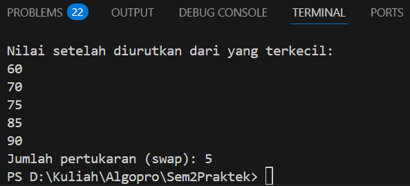
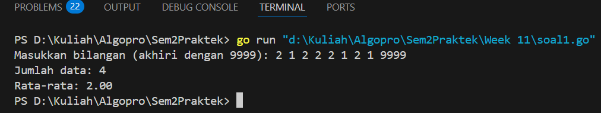
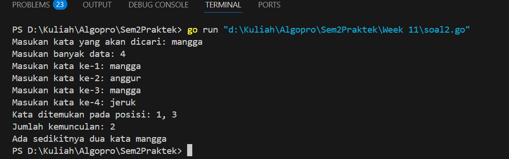
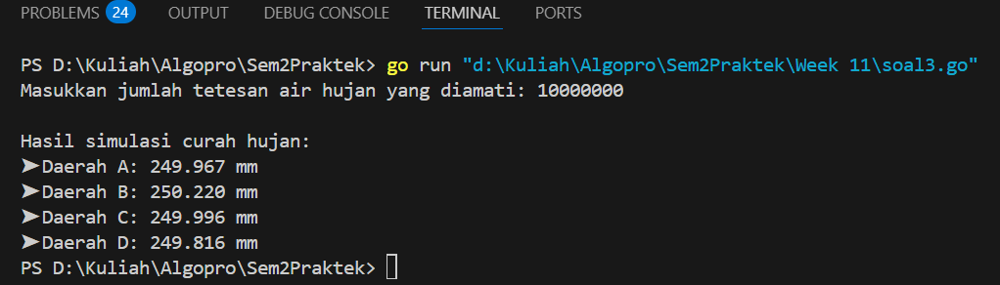
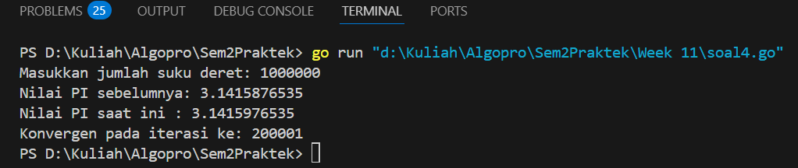
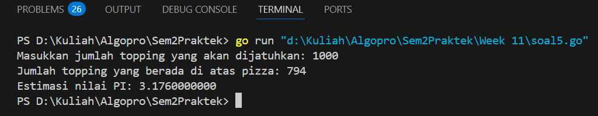

<h1 align="center">Laporan Praktikum Modul 17</h1>
<p align="center">Balawan Satria Lhaksana Putra Mazzimo - 103112430004</p>


## Dasar Teori
Skema pemrosesan sekuensial merupakan salah satu pola dasar dalam pemrograman algoritma yang digunakan untuk memproses data secara berurutan sesuai urutan masuknya data. Dalam pendekatan ini, data dapat dibaca dan diproses hingga jumlah tertentu (tanpa marker), atau hingga ditemukan penanda khusus (marker) yang menandai akhir data. Konsep ini penting karena memberikan kerangka berpikir sistematis dalam menyusun algoritma yang efisien, termasuk penanganan kondisi seperti data kosong, pemrosesan elemen pertama sebagai kasus khusus, dan pencarian nilai maksimum atau rata-rata dari sekumpulan data. Pendekatan sekuensial ini mencerminkan logika prosedural yang mendasari banyak algoritma dasar dalam ilmu komputer.

## Guided
### Soal 1
```go
package main

import "fmt"

func bubble(nilai []int) int {
	n := len(nilai)
	swapCount := 0 

	for i := 0; i < n-1; i++ {
		for j := 0; j < n-i-1; j++ {
			if nilai[j] > nilai[j+1] {
				nilai[j], nilai[j+1] = nilai[j+1], nilai[j]
				swapCount++
			}
		}
	}
	return swapCount
}

func main() {
	nilai := []int{75, 60, 90, 85, 70}
	swaps := bubble(nilai)

	fmt.Println("Nilai setelah diurutkan dari yang terkecil:")
	for _, n := range nilai {
		fmt.Println(n)
	}

	fmt.Printf("Jumlah pertukaran (swap): %d\n", swaps)
}
```
Hasil :

Penjelasan :
Program ini menggunakan algoritma bubble sort untuk mengurutkan slice bilangan bulat dari yang terkecil ke yang terbesar, sambil menghitung jumlah pertukaran (swap) yang terjadi selama proses pengurutan. Fungsi `bubble` menerima slice `nilai`, lalu membandingkan setiap elemen berurutan dan menukarnya jika elemen sebelumnya lebih besar dari elemen sesudahnya. Setiap kali terjadi pertukaran, variabel `swapCount` ditambah satu. Di dalam fungsi `main`, data awal berupa slice `nilai` berisi lima angka yang akan diurutkan menggunakan bubble sort. Setelah proses selesai, program mencetak daftar nilai yang telah diurutkan serta total jumlah pertukaran yang dilakukan.
## Unguided
#### Soal 1

>Diberikan sejumlah bilangan real yang diakhiri dengan marker 9999, cari rerata dari bilanganbilangan tersebut

```go
package main

import (
	"fmt"
)

func main() {
	var input float64
	var jumlah float64
	var banyakData int

	fmt.Print("Masukkan bilangan (akhiri dengan 9999): ")
	fmt.Scanln(&input)

	if input == 9999 {
		fmt.Println("Tidak ada bilangan yang dihitung.")
	} else {
		jumlah = input
		banyakData = 1

		for {
			fmt.Scanln(&input)
			if input == 9999 {
				break
			}
			jumlah += input
			banyakData++
		}

		rata := jumlah / float64(banyakData)
		fmt.Printf("Jumlah data: %d\n", banyakData)
		fmt.Printf("Rata-rata: %.2f\n", rata)
	}
}
```
Hasil :

**Deskripsi :**
Program di atas berfungsi untuk menghitung rata-rata dari sekumpulan bilangan yang dimasukkan oleh pengguna, dengan syarat proses input dihentikan jika pengguna memasukkan angka sentinel `9999`. Program dimulai dengan meminta satu bilangan pertama. Jika bilangan pertama adalah `9999`, maka tidak ada bilangan yang dihitung dan program mencetak pesan bahwa tidak ada bilangan yang dihitung. Namun jika bukan, maka bilangan pertama akan langsung dijumlahkan, dan proses dilanjutkan dengan menerima input berikutnya dalam perulangan `for`.

Selama pengguna terus memasukkan bilangan selain `9999`, program akan menambahkan bilangan tersebut ke dalam total (`jumlah`) dan menghitung banyaknya data (`banyakData`). Setelah perulangan berhenti, program menghitung rata-rata dengan membagi jumlah seluruh bilangan dengan jumlah data yang valid, lalu mencetak jumlah data dan rata-rata tersebut dengan dua angka di belakang koma. Program ini cocok digunakan sebagai contoh pemrosesan data dinamis berbasis input sampai kondisi tertentu terpenuhi.
#### Soal 2

>Diberikan string x dan n buah string. x adalah data pertama yang dibaca, n adalah data bilangan yang dibaca kedua, dan n data berikutnya adalah data string. Buat algoritma untuk menjawab pertanyaan berikut: a. Apakah string x ada dalam kumpulan n data string tersebut? b. Pada posisi ke berapa string x tersebut ditemukan? c. Ada berapakah string x dalam kumpulan n data string tersebut? d. Adakah sedikitnya dua string x dalam n data string tersebut?

```go
package main

import (
	"fmt"
)

func cariString(target string, banyak int) {
	var posisi []int

	for i := 1; i <= banyak; i++ {
		var input string
		fmt.Print("Masukan kata ke-", i, ": ")
		fmt.Scanln(&input)
		if input == target {
			posisi = append(posisi, i)
		}
	}

	if len(posisi) > 0 {
		fmt.Print("Kata ditemukan pada posisi: ")
		for i, p := range posisi {
			if i > 0 {
				fmt.Print(", ")
			}
			fmt.Print(p)
		}
		fmt.Println("\nJumlah kemunculan:", len(posisi))
		if len(posisi) >= 2 {
			fmt.Println("Ada sedikitnya dua kata", target)
		} else {
			fmt.Println("Hanya ada satu string", target)
		}
	} else {
		fmt.Println("Kata tidak ditemukan.")
	}
}

func main() {
	var target string
	var banyak int

	fmt.Print("Masukan kata yang akan dicari: ")
	fmt.Scanln(&target)
	fmt.Print("Masukan banyak data: ")
	fmt.Scanln(&banyak)

	cariString(target, banyak)
}
```
Hasil :

**Deskripsi :**
Program di atas digunakan untuk mencari dan menghitung jumlah kemunculan sebuah kata (string) dalam sekumpulan input string yang dimasukkan oleh pengguna. Program dimulai dengan meminta pengguna memasukkan **kata target** yang akan dicari dan **jumlah total kata** yang akan dimasukkan. Selanjutnya, fungsi `cariString` akan dijalankan dengan dua parameter tersebut.

Dalam fungsi `cariString`, dilakukan perulangan sebanyak jumlah data yang ditentukan (`banyak`). Pada setiap iterasi, program meminta pengguna memasukkan satu kata. Jika kata yang dimasukkan sama dengan kata target, maka indeks (posisi keberapa kata itu dimasukkan) akan disimpan ke dalam slice `posisi`. Setelah semua kata dimasukkan, program akan mengevaluasi apakah kata target ditemukan atau tidak. Jika ditemukan, maka posisi kemunculannya akan ditampilkan, disertai dengan jumlah total kemunculan dan keterangan apakah kata tersebut muncul lebih dari satu kali atau hanya satu kali. Jika tidak ditemukan sama sekali, maka program akan mencetak pesan bahwa kata tidak ditemukan. Program ini efektif untuk latihan pengolahan string dan pencarian posisi dalam data berbasis input pengguna.
#### Soal 3

>Empat daerah A, B, C, dan D yang berdekatan ingin mengukur curah hujan. Keempat daerah tersebut digambarkan pada bidang berikut: Misal curah hujan dihitung berdasarkan banyaknya tetesan air hujan. Setiap tetesan berukuran 0.0001 ml curah hujan. Tetesan air hujan turun secara acak dari titik (0,0) sampai (1,1). Jika diterima input yang menyatakan banyaknya tetesan air hujan. Tentukan curah hujan untuk keempat daerah tersebut.
>Buatlah program yang menerima input berupa banyaknya tetesan air hujan. Kemudian buat koordinat/titik (x, y) secara acak dengan menggunakan fungsi rand.Float64(). Hitung dan tampilkan banyaknya tetesan yang jatuh pada daerah A, B, C dan D. Konversikan satu tetesan berukuran 0.0001 milimeter.

```go
package main

import (
	"fmt"
	"math/rand"
	"time"
)

func mintaJumlahTetes() int {
	var totalTetes int
	fmt.Print("Masukkan jumlah tetesan air hujan yang diamati: ")
	fmt.Scan(&totalTetes)
	return totalTetes
}

func simulasikanTetes(totalTetes int) (int, int, int, int) {
	var A, B, C, D int
	for i := 0; i < totalTetes; i++ {
		x := rand.Float64()
		y := rand.Float64()

		switch {
		case x < 0.5 && y < 0.5:
			A++
		case x >= 0.5 && y < 0.5:
			B++
		case x < 0.5 && y >= 0.5:
			C++
		default:
			D++
		}
	}
	return A, B, C, D
}

func hitungCurah(A, B, C, D int, ukuran float64) (float64, float64, float64, float64) {
	return float64(A) * ukuran, float64(B) * ukuran, float64(C) * ukuran, float64(D) * ukuran
}

func tampilkanCurah(a, b, c, d float64) {
	fmt.Printf("\nHasil simulasi curah hujan:\n")
	fmt.Printf("➤ Daerah A: %.3f mm\n", a)
	fmt.Printf("➤ Daerah B: %.3f mm\n", b)
	fmt.Printf("➤ Daerah C: %.3f mm\n", c)
	fmt.Printf("➤ Daerah D: %.3f mm\n", d)
}

func main() {
	rand.Seed(time.Now().UnixNano())

	const volumeTetes = 0.0001

	jumlah := mintaJumlahTetes()
	a, b, c, d := simulasikanTetes(jumlah)

	curahA, curahB, curahC, curahD := hitungCurah(a, b, c, d, volumeTetes)
	tampilkanCurah(curahA, curahB, curahC, curahD)
}
```
Hasil :

Deskripsi :
Program di atas adalah simulasi sederhana untuk menghitung **curah hujan di empat daerah (A, B, C, dan D)** berdasarkan jumlah tetesan air hujan yang dimasukkan oleh pengguna. Program menggunakan koordinat acak (dari `x` dan `y` antara 0.0 hingga 1.0) untuk menentukan di daerah mana setiap tetesan jatuh, lalu menghitung jumlah tetesan di setiap daerah dan mengalikan jumlah tersebut dengan volume tetesan untuk mendapatkan curah hujan dalam milimeter.

Fungsi `mintaJumlahTetes()` meminta pengguna memasukkan jumlah tetesan air hujan yang akan disimulasikan. Fungsi `simulasikanTetes()` menggunakan fungsi `rand.Float64()` untuk menghasilkan koordinat acak, lalu menentukan daerah berdasarkan kuadran koordinat:
- `(x < 0.5, y < 0.5)` → Daerah A
- `(x ≥ 0.5, y < 0.5)` → Daerah B
- `(x < 0.5, y ≥ 0.5)` → Daerah C
- `(x ≥ 0.5, y ≥ 0.5)` → Daerah D
Fungsi `hitungCurah()` menghitung curah hujan untuk masing-masing daerah dengan mengalikan jumlah tetesan di setiap daerah dengan volume satu tetesan (`0.0001 mm`). Terakhir, `tampilkanCurah()` mencetak hasil curah hujan per daerah dengan tiga angka di belakang koma. Program ini merupakan contoh aplikasi **pembangkitan data acak dan pemodelan probabilistik** dalam konteks simulasi lingkungan.
## Soal 4

>Berdasarkan formula Leibniz, nilai π dapat dinyatakan sebagai deret harmonik ganti sebagai berikut:
>1 − 1/3 + 1/5 − 1/7 + 1/9 − ⋯ = phi/4 Suku ke-i dinyatakan sebagai 𝑆𝑖 dan jumlah deret adalah 𝑆. Apabila diketahui suku pertama 𝑆1 = 1, suku kedua 𝑆2 = −1/3 . Temukan rumus untuk suku ke-𝒊 atau 𝑆𝑖 . Berdasarkan rumus tersebut, buatlah program yang menghitung 𝑆 untuk 1000000 suku pertama.
>Setelah jalan, modifikasi program tersebut agar menyimpan nilai dua suku yang bersebelahan, 𝑆𝑖 dan 𝑆𝑖+1. Buatlah agar program tersebut sekarang berhenti apabila selisih dari kedua suku tersebut tidak lebih dari 0.00001.

```go
package main

import (
	"fmt"
	"math"
)

// Fungsi untuk membulatkan ke 10 angka desimal
func bulatkan(x float64) float64 {
	return math.Trunc(x*1e10) / 1e10
}

// Fungsi menghitung pendekatan nilai PI menggunakan deret Leibniz
func pendekatanPI(batas int) (float64, float64, int) {
	total, sebelumnya := 0.0, 0.0

	for i, tanda := 0, 1.0; i < batas; i, tanda = i+1, -tanda {
		total += tanda / float64(2*i+1)
		hasilSekarang := total * 4

		if i > 0 && math.Abs(hasilSekarang-sebelumnya) < 0.00001 {
			return bulatkan(sebelumnya), bulatkan(hasilSekarang), i + 1
		}
		sebelumnya = hasilSekarang
	}
	return bulatkan(sebelumnya), bulatkan(sebelumnya), batas
}

func main() {
	var jumlahSuku int
	fmt.Print("Masukkan jumlah suku deret: ")
	fmt.Scan(&jumlahSuku)

	piLama, piBaru, iterasi := pendekatanPI(jumlahSuku)

	fmt.Printf("Nilai PI sebelumnya: %.10f\n", piLama)
	fmt.Printf("Nilai PI saat ini : %.10f\n", piBaru)
	fmt.Printf("Konvergen pada iterasi ke: %d\n", iterasi)
}
```
Hasil :

Deskripsi :
Program di atas menghitung pendekatan nilai **π (pi)** menggunakan deret **Leibniz**, Fungsi `pendekatanPI` menerima parameter jumlah suku (`batas`) dan menggunakan perulangan untuk menjumlahkan suku-suku deret secara bergantian tanda (positif dan negatif). Nilai total pada setiap iterasi dikalikan 4 untuk mendapatkan pendekatan nilai pi, dan hasil tersebut dibandingkan dengan hasil sebelumnya. Jika selisih antara dua hasil berturut-turut kurang dari `0.00001`, fungsi akan berhenti lebih awal dan mengembalikan nilai pi lama, pi baru, dan jumlah iterasi saat konvergen. Fungsi `bulatkan` digunakan untuk memangkas hasil pi ke 10 angka di belakang koma dengan `math.Trunc`.

Di fungsi `main`, program meminta pengguna untuk memasukkan jumlah suku deret yang ingin digunakan. Setelah itu, hasil pendekatan pi dan jumlah iterasi ditampilkan, dengan keterangan nilai pi sebelumnya, nilai pi saat ini, dan iterasi ke berapa konvergensi terjadi. Program ini sangat berguna untuk mendemonstrasikan bagaimana pendekatan numerik terhadap konstanta matematika dapat dilakukan dengan deret tak hingga.
## Soal 5

>Monti bekerja pada sebuah kedai pizza, saking ramainya kedai tersebut membuat Monti tidak ada waktu untuk bersantai. Suatu ketika saat sedang menaburkan topping pada pizza yang diletakkan pada wadah berbentuk persegi, terpikirkan oleh Monti cara menghitung berapa banyak topping yang dia butuhkan, dan cara menghitung nilai 𝝅. Ilustrasi seperti gambar yang diberikan di bawah, topping adalah lingkaran-lingkaran kecil. Ada yang tepat berada di atas pizza, dan ada yang jatuh di dalam kotak tetapi berada di luar pizza.
>Apabila luas pizza yang memiliki radius r adalah 𝐿𝑢𝑎𝑠𝑃𝑖𝑧𝑧𝑎 = 𝜋𝑟 2 dan luas wadah pizza yang memiliki panjang sisi 𝑑 = 2𝑟 adalah 𝐿𝑢𝑎𝑠𝑊𝑎𝑑𝑎ℎ = 𝑑2 = 4𝑟 2 , maka diperoleh perbandingan luas kedua bidang tersebut 𝐿𝑢𝑎𝑠𝑃𝑖𝑧𝑧𝑎 𝐿𝑢𝑎𝑠𝑊𝑎𝑑𝑎ℎ = 𝜋𝑟 2 4𝑟 2 = 𝜋 4 Persamaan lingkaran adalah (𝑥 − 𝑥𝑐) 2 + (𝑦 − 𝑦𝑐) 2 = 𝑟 2 dengan titik pusat lingkaran adalah (𝑥𝑐 , 𝑦𝑐). Suatu titik sembarang (𝑥, 𝑦) dikatakan berada di dalam lingkaran apabila memenuhi ketidaksamaan: (𝑥 − 𝑥𝑐) 2 + (𝑦 − 𝑦𝑐) 2 ≤ 𝑟 2 Pada ilustrasi topping berbentuk bulat kecil merah dan biru pada gambar adalah titik-titik (𝑥, 𝑦) acak pada sebuah wadah yang berisi pizza. Dengan jumlah yang sangat banyak dan ditaburkan merata (secara acak), maka kita bisa mengetahui berapa banyak titik/topping yang berada tepat di dalam pizza menggunakan ketidaksamaan di atas. Buatlah program yang menerima input berupa banyaknya topping yang akan ditaburkan, kemudian buat titik acak (𝑥, 𝑦) dari bilangan acak riil pada kisaran nilai 0 hingga 1 sebanyak topping yang diberikan. Hitung dan tampilkan berapa banyak topping yang jatuh tepat di atas pizza. Titik pusat pizza adalah (0.5, 0.5) dan jari-jari pizza adalah 0.5 satuan wadah.
>Apabila topping yang ditaburkan oleh Monti secara merata berjumlah yang sangat banyak, maka topping akan menutupi keseluruhan wadah pizza. Luas Pizza sebanding dengan topping yang berada pada pizza, sedangkan Luas Wadah sebanding dengan banyaknya topping yang ditaburkan. Dengan menggunakan rumus perbandingan luas yang diberikan di atas, maka nilai konstanta 𝜋 dapat dihitung. Modifikasi program di atas sehingga dapat menghitung dan menampilkan nilai konstanta π.

```go
package main

import (
	"fmt"
	"math/rand"
	"time"
)

// Inisialisasi seed random
func mulaiAcak() {
	rand.Seed(time.Now().UnixNano())
}

// Input jumlah titik (topping) yang ingin diuji
func inputTopping() int {
	var jumlah int
	fmt.Print("Masukkan jumlah topping yang akan dijatuhkan: ")
	fmt.Scan(&jumlah)
	return jumlah
}

// Mengecek apakah titik (x,y) berada di dalam lingkaran (pizza)
func dalamPizza(x, y, cx, cy, r float64) bool {
	return (x-cx)*(x-cx)+(y-cy)*(y-cy) <= r*r
}

// Menghitung berapa topping yang jatuh tepat di atas pizza
func hitungDalamPizza(total int, cx, cy, r float64) int {
	hitung := 0
	for i := 0; i < total; i++ {
		x := rand.Float64()
		y := rand.Float64()
		if dalamPizza(x, y, cx, cy, r) {
			hitung++
		}
	}
	return hitung
}

// Mengestimasi nilai PI dari rasio titik dalam lingkaran terhadap total titik
func estimasiPI(jumlah, dalam int) float64 {
	return float64(dalam) / float64(jumlah) * 4
}

func main() {
	mulaiAcak()

	jumlahTitik := inputTopping()

	// Koordinat pusat lingkaran (pizza) dan radiusnya
	cx, cy, r := 0.5, 0.5, 0.5

	titikDalam := hitungDalamPizza(jumlahTitik, cx, cy, r)

	fmt.Printf("Jumlah topping yang berada di atas pizza: %d\n", titikDalam)

	pi := estimasiPI(jumlahTitik, titikDalam)
	fmt.Printf("Estimasi nilai PI: %.10f\n", pi)
}
```
Hasil :

Deskripsi :
Program di atas adalah sebuah simulasi sederhana untuk mengestimasi nilai π (pi) menggunakan metode Monte Carlo. Cara kerjanya adalah dengan “menjatuhkan” sejumlah titik secara acak di dalam sebuah persegi dengan sisi 1x1, di mana terdapat sebuah lingkaran dengan radius 0.5 yang berada tepat di tengah persegi tersebut (pada koordinat 0.5,0.5). Program kemudian menghitung berapa banyak titik yang jatuh di dalam lingkaran tersebut. Dengan membandingkan rasio titik yang berada dalam lingkaran terhadap total titik yang dijatuhkan, dan mengalikan hasilnya dengan 4, program ini memberikan perkiraan nilai π. Semakin banyak titik yang dijatuhkan, semakin akurat estimasi nilai π yang diperoleh.
