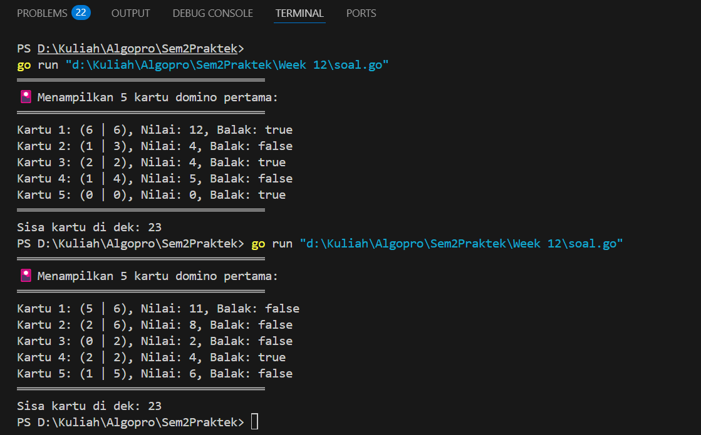
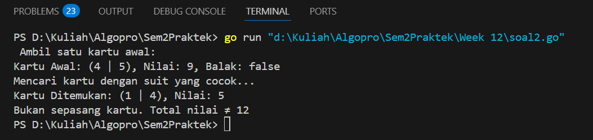
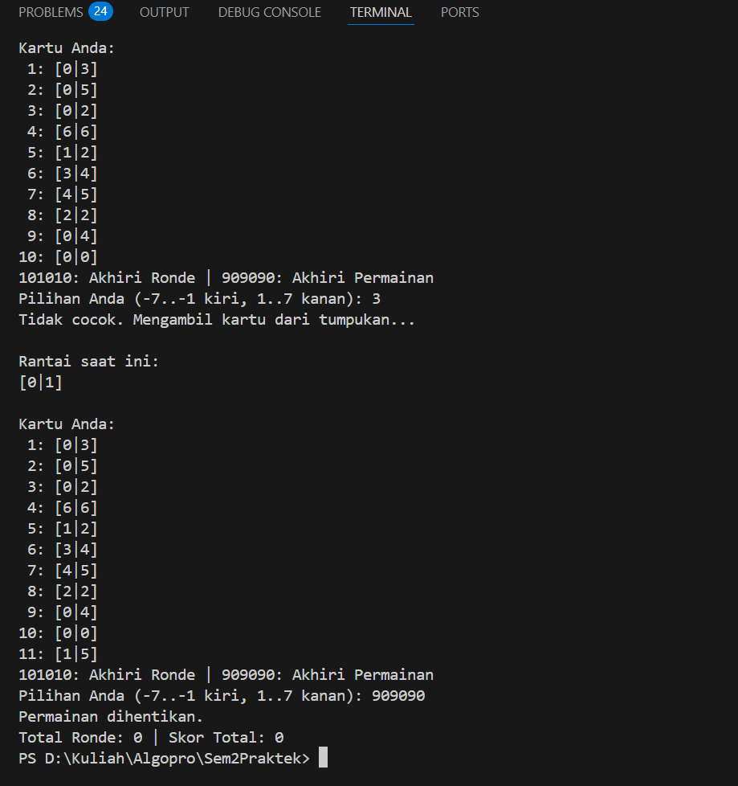
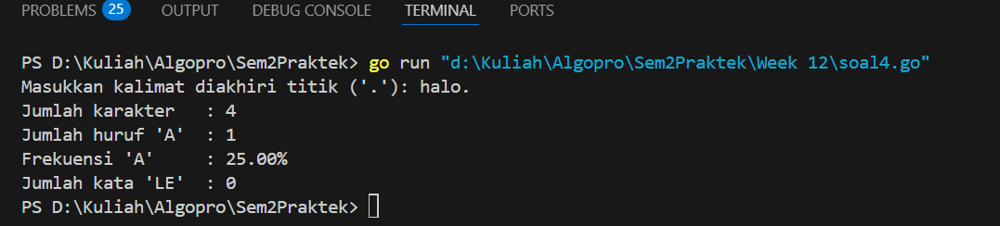

<h1 align="center">Laporan Praktikum Modul 18</h1>
<p align="center">Balawan Satria Lhaksana Putra Mazzimo - 103112430004</p>


## Dasar Teori
Mesin abstrak adalah model komputasi yang dibangun di atas mesin komputasi yang sudah ada, dengan menggunakan tipe data dan operasi dasar dari mesin sebelumnya untuk membentuk operasi baru. Konsep ini digunakan dalam pengembangan perangkat lunak. Contoh penerapannya dapat dilihat pada mesin domino, yang memiliki tipe data berupa kartu domino dengan dua sisi bernilai 0 hingga 6 pip, dan operasi dasar seperti mengocok, mengambil, melihat, dan menilai kartu. Setiap kartu bernilai total pip dari kedua sisinya (0–12), tanpa duplikasi (misalnya, kartu 1-4 sama dengan 4-1). Kasus penggunaan mesin domino mencakup pencarian kartu dengan gambar yang sama, pengecekan kartu balak (kedua sisi sama), dan penjumlahan dua kartu menjadi 12. Beberapa permainan yang menggunakan prinsip ini antara lain Gapleh, Kiu-kiu, Luzon, dan Texas 42.
## Unguided
#### Soal 1

> Implementasi operasi dasar mesin domino sebagai sebuah subprogram: 
> a) Buat tipe data kartu domino (Domino) yang menyimpan informasi 
> 	➢ gambar (suit) kedua sisi kartu 
> 	➢ nilai kartu 
> 	➢ Boolean data yang menyatakan kartu ini balak atau bukan 
> 	➢ Buat tipe data satu set kartu domino (Dominoes) 
> 	➢ Array menyimpan 28 kartu Domino 
> 	➢ Jumlah kartu tersisa dalam array tersebut 
> b) prosedur kocokKartu(Dominoes) 
> c) fungsi ambilKartu(Dominoes) → Domino 
> d) fungsi gambarKartu(Domino,suit int) → int 
> e) fungsi nilaiKartu(Domino) → int

```go
package main

import (
	"fmt"
	"math/rand"
	"time"
)

type Domino struct {
	sisiSatu int
	sisiDua  int
	nilai    int
	balak    bool
}

type Dominoes struct {
	kartu  [28]Domino
	jumlah int
}

func inisialisasiDomino(d *Dominoes) {
	index := 0
	for i := 0; i <= 6; i++ {
		for j := i; j <= 6; j++ {
			d.kartu[index] = Domino{
				sisiSatu: i,
				sisiDua:  j,
				nilai:    i + j,
				balak:    i == j,
			}
			index++
		}
	}
	d.jumlah = 28
}

func kocokKartu(d *Dominoes) {
	rand.Seed(time.Now().UnixNano())
	for i := d.jumlah - 1; i > 0; i-- {
		j := rand.Intn(i + 1)
		d.kartu[i], d.kartu[j] = d.kartu[j], d.kartu[i]
	}
}

func ambilKartu(d *Dominoes) Domino {
	if d.jumlah == 0 {
		return Domino{-1, -1, -1, false}
	}
	d.jumlah--
	return d.kartu[d.jumlah]
}

func nilaiKartu(k Domino) int {
	return k.nilai
}

func main() {
	var dominoSet Dominoes

	inisialisasiDomino(&dominoSet)
	kocokKartu(&dominoSet)

	fmt.Println("════════════════════════════════════")
	fmt.Println("🎴 Menampilkan 5 kartu domino pertama:")
	fmt.Println("════════════════════════════════════")

	for i := 0; i < 5; i++ {
		kartu := ambilKartu(&dominoSet)
		fmt.Printf("Kartu %d: (%d | %d), Nilai: %d, Balak: %v\n",
			i+1, kartu.sisiSatu, kartu.sisiDua, nilaiKartu(kartu), kartu.balak)
	}

	fmt.Println("════════════════════════════════════")
	fmt.Printf("Sisa kartu di dek: %d\n", dominoSet.jumlah)
}
```
Hasil :

**Deskripsi :**
Program ini merupakan simulasi sederhana permainan domino dalam bahasa Go. Pertama, program membuat 28 kombinasi kartu domino menggunakan struktur data `Domino`, yang berisi dua sisi angka, nilai total (jumlah kedua sisi), dan status apakah kartu tersebut balak (kedua sisi sama). Semua kartu disimpan dalam array `Dominoes`, lalu diacak menggunakan metode Fisher-Yates Shuffle agar urutannya acak setiap kali dijalankan. Setelah pengacakan, program mengambil 5 kartu teratas dari tumpukan dan menampilkannya satu per satu lengkap dengan nilai dan status balaknya. Proses pengambilan kartu dilakukan dari indeks terakhir (seperti tumpukan), dan jumlah kartu dikurangi setiap kali kartu diambil. Jika kartu habis, fungsi akan mengembalikan kartu kosong sebagai sinyal. Setelah lima kartu ditampilkan, program mencetak sisa jumlah kartu dalam dek.
#### Soal 2

>Realisasi aksi berikut menggunakan operasi-operasi dasar mesin domino: 
>a) prosedur galiKartu(Dominoes,Domino) yang mengambil kartu dari tumpukan sampai diperoleh kartu dengan gambar (suit) yang sama dengan kartu yang diberikan
>b) fungsi sepasangKartu(Domino,Domino) → boolean; yang memberikan nilai true jika total nilai kartu adalah 12 dan false jika tidak.

```go
package main

import (
	"fmt"
	"math/rand"
	"time"
)

type Domino struct {
	sisiSatu int
	sisiDua  int
	nilai    int
	balak    bool
}

type Dominoes struct {
	kartu  [28]Domino
	jumlah int
}

func inisialisasiDomino(d *Dominoes) {
	index := 0
	for i := 0; i <= 6; i++ {
		for j := i; j <= 6; j++ {
			d.kartu[index] = Domino{
				sisiSatu: i,
				sisiDua:  j,
				nilai:    i + j,
				balak:    i == j,
			}
			index++
		}
	}
	d.jumlah = 28
}

func kocokKartu(d *Dominoes) {
	rand.Seed(time.Now().UnixNano())
	for i := d.jumlah - 1; i > 0; i-- {
		j := rand.Intn(i + 1)
		d.kartu[i], d.kartu[j] = d.kartu[j], d.kartu[i]
	}
}

func ambilKartu(d *Dominoes) Domino {
	if d.jumlah == 0 {
		return Domino{-1, -1, -1, false}
	}
	d.jumlah--
	return d.kartu[d.jumlah]
}

func nilaiKartu(k Domino) int {
	return k.nilai
}

func galiKartu(d *Dominoes, acuan Domino) Domino {
	for d.jumlah > 0 {
		kartu := ambilKartu(d)
		if kartu.sisiSatu == acuan.sisiSatu || kartu.sisiSatu == acuan.sisiDua ||
			kartu.sisiDua == acuan.sisiSatu || kartu.sisiDua == acuan.sisiDua {
			return kartu
		}
	}
	return Domino{-1, -1, -1, false} 
}

func sepasangKartu(k1, k2 Domino) bool {
	return (k1.nilai + k2.nilai) == 12
}

func main() {
	var dominoSet Dominoes
	inisialisasiDomino(&dominoSet)
	kocokKartu(&dominoSet)

	fmt.Println(" Ambil satu kartu awal:")
	kartuAwal := ambilKartu(&dominoSet)
	fmt.Printf("Kartu Awal: (%d | %d), Nilai: %d, Balak: %v\n",
		kartuAwal.sisiSatu, kartuAwal.sisiDua, kartuAwal.nilai, kartuAwal.balak)

	fmt.Println("Mencari kartu dengan suit yang cocok...")
	kartuHasil := galiKartu(&dominoSet, kartuAwal)

	if kartuHasil.nilai != -1 {
		fmt.Printf("Kartu Ditemukan: (%d | %d), Nilai: %d\n",
			kartuHasil.sisiSatu, kartuHasil.sisiDua, kartuHasil.nilai)

		if sepasangKartu(kartuAwal, kartuHasil) {
			fmt.Println("Sepasang kartu! Total nilai = 12")
		} else {
			fmt.Println("Bukan sepasang kartu. Total nilai ≠ 12")
		}
	} else {
		fmt.Println("Tidak ada kartu dengan suit yang cocok.")
	}
}
```
Hasil :

**Deskripsi :**
Program ini merupakan pengembangan simulasi permainan domino. Di awal, program membuat dan mengocok satu set lengkap kartu domino berjumlah 28 kartu. Setiap kartu terdiri dari dua sisi, nilai total (penjumlahan kedua sisi), dan status balak (jika kedua sisi bernilai sama). Setelah pengocokan, satu kartu diambil sebagai acuan. Program kemudian menggunakan prosedur `galiKartu` untuk mengambil kartu lain dari tumpukan sampai ditemukan kartu yang memiliki salah satu sisi yang sama (suit) dengan kartu acuan.

Setelah kartu yang sesuai ditemukan, program memeriksa apakah pasangan kartu tersebut memiliki total nilai 12 menggunakan fungsi `sepasangKartu`. Jika jumlah nilainya tepat 12, maka dinyatakan sebagai “sepasang kartu”. Jika tidak, maka hanya disebut cocok dari sisi suit-nya saja. Program ini menunjukkan bagaimana operasi-operasi dasar seperti pencocokan sisi dan pengecekan nilai bisa direalisasikan secara modular dengan fungsi dan prosedur dalam simulasi mesin domino.
#### Soal 3

>Implementasi salah satu permainan domino. Lihat lampiran untuk deskripsi permainan Gapleh.

```go
package main

import (
	"fmt"
	"math/rand"
	"time"
)

type Domino struct {
	kiri  int
	kanan int
}

func buatSetDomino() []Domino {
	var set []Domino
	for i := 0; i <= 6; i++ {
		for j := i; j <= 6; j++ {
			set = append(set, Domino{i, j})
		}
	}
	return set
}

func kocok(set []Domino) {
	rand.Seed(time.Now().UnixNano())
	rand.Shuffle(len(set), func(i, j int) {
		set[i], set[j] = set[j], set[i]
	})
}

func cocokDengan(karte Domino, ujung int) bool {
	return karte.kiri == ujung || karte.kanan == ujung
}

func balik(karte Domino) Domino {
	return Domino{karte.kanan, karte.kiri}
}

func cetak(karte Domino) string {
	return fmt.Sprintf("[%d|%d]", karte.kiri, karte.kanan)
}

func main() {
	dek := buatSetDomino()
	ronde := 0
	totalSkor := 0

	for {
		ronde++
		fmt.Printf("\n=== Ronde %d ===\n", ronde)
		kocok(dek)

		tumpukan := append([]Domino(nil), dek...)
		tangan := tumpukan[:7]
		tumpukan = tumpukan[7:]

		rantai := []Domino{tumpukan[0]}
		tumpukan = tumpukan[1:]
		skor := 0

		for {
			fmt.Println("\nRantai saat ini:")
			for _, k := range rantai {
				fmt.Print(cetak(k), " ")
			}
			fmt.Println("\n\nKartu Anda:")
			for i, k := range tangan {
				fmt.Printf("%2d: %s\n", i+1, cetak(k))
			}
			fmt.Println("101010: Akhiri Ronde | 909090: Akhiri Permainan")
			fmt.Print("Pilihan Anda (-7..-1 kiri, 1..7 kanan): ")

			var pilihan int
			fmt.Scan(&pilihan)

			if pilihan == 101010 {
				fmt.Println("Ronde dihentikan oleh pemain.")
				break
			} else if pilihan == 909090 {
				fmt.Println("Permainan dihentikan.")
				fmt.Printf("Total Ronde: %d | Skor Total: %d\n", ronde-1, totalSkor)
				return
			}

			if pilihan < -len(tangan) || pilihan > len(tangan) || pilihan == 0 {
				fmt.Println("Pilihan tidak valid.")
				continue
			}

			index := pilihan
			if index < 0 {
				index = -index
			}

			if index > len(tangan) {
				fmt.Println("Indeks tidak tersedia.")
				continue
			}

			kartu := tangan[index-1]
			bisa := false

			if pilihan < 0 {
				ujung := rantai[0].kiri
				if cocokDengan(kartu, ujung) {
					if kartu.kanan == ujung {
						rantai = append([]Domino{kartu}, rantai...)
					} else {
						rantai = append([]Domino{balik(kartu)}, rantai...)
					}
					bisa = true
				}
			} else {
				ujung := rantai[len(rantai)-1].kanan
				if cocokDengan(kartu, ujung) {
					if kartu.kiri == ujung {
						rantai = append(rantai, kartu)
					} else {
						rantai = append(rantai, balik(kartu))
					}
					bisa = true
				}
			}

			if bisa {
				tangan = append(tangan[:index-1], tangan[index:]...)
				skor++
			} else {
				if len(tumpukan) > 0 {
					fmt.Println("Tidak cocok. Mengambil kartu dari tumpukan...")
					tangan = append(tangan, tumpukan[0])
					tumpukan = tumpukan[1:]
				} else {
					fmt.Println("Tidak cocok dan tumpukan habis.")
				}
			}

			if len(tangan) == 0 {
				fmt.Println("Semua kartu habis. Ronde selesai!")
				break
			}

			// Cek apakah pemain bisa main lagi
			bisaMain := false
			ujungKiri := rantai[0].kiri
			ujungKanan := rantai[len(rantai)-1].kanan
			for _, k := range tangan {
				if cocokDengan(k, ujungKiri) || cocokDengan(k, ujungKanan) {
					bisaMain = true
					break
				}
			}
			if !bisaMain && len(tumpukan) == 0 {
				fmt.Println("Tidak ada kartu cocok & tumpukan habis. Ronde selesai!")
				break
			}
		}

		fmt.Printf("Skor Ronde %d: %d\n", ronde, skor)
		totalSkor += skor
	}
}
```
Hasil :

Deskripsi :
Program ini adalah simulasi permainan kartu domino satu pemain melawan sistem, di mana pemain mencoba menyusun kartu dari tangannya ke rantai domino dengan mencocokkan sisi kiri atau kanan. Pertama, program membuat set kartu domino lengkap (28 kartu, sisi 0–6 tanpa duplikat), lalu mengacak urutan kartunya. Dari tumpukan kartu tersebut, pemain akan diberikan 7 kartu, dan satu kartu acak akan menjadi awal dari rantai. Pemain diminta memilih kartu yang bisa disambungkan ke kiri (pilih negatif) atau kanan (pilih positif) rantai, asalkan salah satu sisi kartu cocok dengan ujung rantai saat ini. Jika kartu tidak cocok, pemain akan otomatis mengambil kartu dari tumpukan (jika masih tersedia).

Permainan akan terus berlanjut hingga pemain kehabisan kartu (menang ronde), atau sudah tidak bisa bergerak dan tumpukan habis. Pemain juga bisa menghentikan ronde dengan mengetik `101010` atau menghentikan permainan sepenuhnya dengan `909090`. Program mencatat dan menampilkan skor pada akhir setiap ronde, serta akumulasi total skor di akhir permainan.
#### Soal 4

>Implementasi mesin abstrak karakter yang bekerja terhadap untaian karakter (yang diakhiri dengan penanda titik (".") dan mempunyai sejumlah operasi dasar. 
>a) Operasi dasar mesin karakter: 
>	➢ Prosedur start(); yang menyiapkan mesin karakter di awal rangkaian karakter. 
>	➢ Prosedur maju(); yang memajukan pembaca ke posisi karakter berikutnya. 
>	➢ Fungsi eop(); yang mengembalikan nilai true apabila sudah mencapai akhir rangkaian, sampai ke penanda titik ("."). 
>	➢ Fungsi cc(); yang mengembalikan karakter yang sedang terbaca, atau berada pada posisi pembacaan mesin. 
>b) Dengan operasi dasar di atas buat algoritma untuk: 
>	➢ Membaca seluruh karakter yang diberikan ke mesin karakter tersebut. 
>	➢ Menghitung berapa banyak karakter yang terbaca. 
>	➢ Menghitung ada berapa huruf "A" yang terbaca. 
>	➢ Menghitung frekuensi kemunculan huruf "A" terhadap seluruh karakter terbaca. 
>	➢ Menghitung ada berapa kata "LE" (pasangan berturutan huruf "L" dan "E") yang terbaca.

```go
package main

import (
	"fmt"
	"strings"
)

var kalimat string
var posisi int
var karakterSekarang byte

func mulai() {
	posisi = 0
	karakterSekarang = kalimat[posisi]
}

func lanjut() {
	posisi++
	if posisi < len(kalimat) {
		karakterSekarang = kalimat[posisi]
	}
}

func ambilKarakter() byte {
	return karakterSekarang
}

func akhirTeks() bool {
	return karakterSekarang == '.'
}

func main() {
	fmt.Print("Masukkan kalimat diakhiri titik ('.'): ")
	fmt.Scanln(&kalimat)

	if !strings.HasSuffix(kalimat, ".") {
		fmt.Println("Input harus diakhiri dengan titik ('.')")
		return
	}

	mulai()

	jmlKarakter := 0
	jmlA := 0
	jmlLE := 0
	var sebelumnya byte = 0

	for !akhirTeks() {
		kar := ambilKarakter()
		jmlKarakter++

		if strings.ToUpper(string(kar)) == "A" {
			jmlA++
		}

		if strings.ToUpper(string(sebelumnya)) == "L" && strings.ToUpper(string(kar)) == "E" {
			jmlLE++
		}

		sebelumnya = kar
		lanjut()
	}

	frekA := float64(jmlA) / float64(jmlKarakter) * 100

	fmt.Println("Jumlah karakter   :", jmlKarakter)
	fmt.Println("Jumlah huruf 'A'  :", jmlA)
	fmt.Printf("Frekuensi 'A'     : %.2f%%\n", frekA)
	fmt.Println("Jumlah kata 'LE'  :", jmlLE)
}
```
Hasil :

Deskripsi :
Program ini merupakan sebuah aplikasi sederhana dalam bahasa Go yang meminta pengguna memasukkan sebuah kalimat yang diakhiri dengan tanda titik ('.'). Program ini kemudian memproses kalimat tersebut untuk menghitung beberapa hal: total jumlah karakter sebelum titik, jumlah huruf 'A' (baik huruf besar maupun kecil), serta jumlah kemunculan pola huruf "LE" secara berurutan. Proses pembacaan karakter dilakukan dengan pendekatan manual, yaitu menggunakan variabel posisi untuk menelusuri setiap karakter dalam string input, dan karakter saat ini disimpan dalam variabel `karakterSekarang`. Program juga memeriksa apakah input valid dengan memastikan kalimat berakhir dengan titik, jika tidak maka program langsung berhenti.

Pada bagian utama (`main`), program melakukan iterasi dari awal kalimat hingga karakter titik ditemukan. Setiap karakter yang dibaca dihitung jumlahnya, dan dicek apakah karakter tersebut adalah huruf 'A' (tanpa membedakan kapitalisasi) untuk menghitung frekuensi huruf 'A'. Selain itu, program juga memeriksa setiap pasangan karakter berurutan apakah membentuk pola "LE" (dengan case-insensitive). Setelah seluruh kalimat diproses, hasil perhitungan jumlah karakter, jumlah huruf 'A', persentase frekuensi huruf 'A', dan jumlah kemunculan kata "LE" ditampilkan ke layar dengan format yang mudah dibaca.
