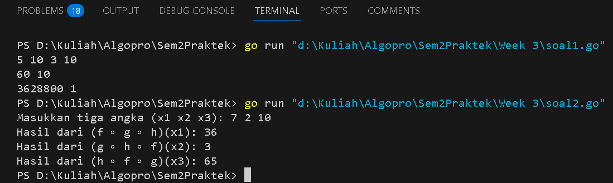

<h1 align="center">Laporan Praktikum Modul 3</h1>
<p align="center">Balawan Satria Lhaksana Putra Mazzimo - 103112430004</p>


## Dasar Teori
Fungsi dalam pemrograman adalah blok kode yang digunakan untuk modularisasi, meningkatkan efisiensi, serta mempermudah debugging dengan menerima parameter, memproses data, dan mengembalikan hasil sesuai kebutuhan.

#### Soal 1

> Minggu ini, mahasiswa Fakultas Informatika mendapatkan tugas dari mata kuliah matematika diskrit untuk mempelajari kombinasi dan permutasi. Jonas salah seorang mahasiswa, iseng untuk mengimplementasikannya ke dalam suatu program. Oleh karena itu bersediakah kalian membantu Jonas?
> - Masukan terdiri dari empat buah bilangan asli 𝑎, 𝑏, 𝑐, dan 𝑑 yang dipisahkan oleh spasi, dengan syarat 𝑎 ≥ 𝑐 dan 𝑏 ≥ 𝑑.
> - Keluaran terdiri dari dua baris. Baris pertama adalah hasil permutasi dan kombinasi 𝒂 terhadap 𝑐, sedangkan baris kedua adalah hasil permutasi dan kombinasi 𝑏 terhadap 𝑑.

```go
package main

import "fmt"

// Fungsi untuk menghitung faktorial secara rekursif
func Faktorial(n int) int {
	if n == 0 || n == 1 {
		return 1
	}
	return n * Faktorial(n-1)
}

// Fungsi untuk menghitung permutasi P(n, r)
func Permutasi(n, r int) int {
	if n < r {
		return 0 // Permutasi tidak valid jika n < r
	}
	return Faktorial(n) / Faktorial(n-r)
}

// Fungsi untuk menghitung kombinasi C(n, r)
func Kombinasi(n, r int) int {
	if n < r {
		return 0 // Kombinasi tidak valid jika n < r
	}
	return Faktorial(n) / (Faktorial(r) * Faktorial(n-r))
}

func main() {
	var a, b, c, d int
	fmt.Scan(&a, &b, &c, &d)

	if a >= c && b >= d {
		fmt.Println(Permutasi(a, c), Kombinasi(a, c))
		fmt.Println(Permutasi(b, d), Kombinasi(b, d))
	} else {
		fmt.Println("Input tidak valid: Pastikan a ≥ c dan b ≥ d")
	}
}

```
Hasil :

Deskripsi :
Program ini digunakan untuk menghitung permutasi dan kombinasi dari dua pasang bilangan berdasarkan rumus matematika yang berlaku, yaitu **P(n, r) = n! / (n - r)!** untuk permutasi dan **C(n, r) = n! / (r!(n - r)!)** untuk kombinasi. Sebelum melakukan perhitungan, program akan memastikan bahwa input memenuhi syarat **n ≥ r**, jika tidak, hasilnya akan dianggap tidak valid dan mengembalikan nilai 0.
#### Soal 2

>Diberikan tiga buah fungsi matematika yaitu 𝑓 (𝑥) = 𝑥 2 , 𝑔 (𝑥) = 𝑥 − 2 dan ℎ (𝑥) = 𝑥 + 1. Fungsi komposisi (𝑓𝑜𝑔𝑜ℎ)(𝑥) artinya adalah 𝑓(𝑔(ℎ(𝑥))). Tuliskan 𝑓(𝑥), 𝑔(𝑥) dan ℎ(𝑥) dalam bentuk function. Masukan terdiri dari sebuah bilangan bulat 𝑎, 𝑏 dan 𝑐 yang dipisahkan oleh spasi. Keluaran terdiri dari tiga baris. Baris pertama adalah (𝑓𝑜𝑔𝑜ℎ)(𝑎), baris kedua (𝑔𝑜ℎ𝑜𝑓)(𝑏), dan baris ketiga adalah (ℎ𝑜𝑓𝑜𝑔)(𝑐)!

```go
package main

import "fmt"

// Fungsi untuk menyimpan rumus f(x) = x^2
func f(x int) int {
	return x * x
}

// Fungsi untuk menyimpan rumus g(x) = x - 2
func g(x int) int {
	return x - 2
}

// Fungsi untuk menyimpan rumus h(x) = x + 1
func h(x int) int {
	return x + 1
}

func main() {
	var x1, x2, x3 int

	// Meminta input dari pengguna
	fmt.Print("Masukkan tiga angka (x1 x2 x3): ")
	fmt.Scan(&x1, &x2, &x3)

	// Menghitung komposisi fungsi
	fogoh := f(g(h(x1)))
	gohof := g(h(f(x2)))
	hofog := h(f(g(x3)))

	// Menampilkan hasil
	fmt.Println("Hasil dari (f ∘ g ∘ h)(x1):", fogoh)
	fmt.Println("Hasil dari (g ∘ h ∘ f)(x2):", gohof)
	fmt.Println("Hasil dari (h ∘ f ∘ g)(x3):", hofog)
}

```
Hasil :

Deskripsi :
Program ini menghitung hasil dari tiga komposisi fungsi matematika, yaitu **(f ∘ g ∘ h)(x1)**, **(g ∘ h ∘ f)(x2)**, dan **(h ∘ f ∘ g)(x3)** berdasarkan input tiga bilangan bulat dari pengguna. Fungsi **f(x) = x²**, **g(x) = x - 2**, dan **h(x) = x + 1** digunakan untuk melakukan transformasi nilai input, kemudian hasil dari setiap komposisi fungsi ditampilkan sebagai output.
#### Soal 3

>Suatu lingkaran didefinisikan dengan koordinat titik pusat (𝑐𝑥, 𝑐𝑦) dengan radius 𝑟. Apabila diberikan dua buah lingkaran, maka tentukan posisi sebuah titik sembarang (𝑥, 𝑦) berdasarkan dua lingkaran tersebut. Masukan terdiri dari beberapa tiga baris. Baris pertama dan kedua adalah koordinat titik pusat dan radius dari lingkaran 1 dan lingkaran 2, sedangkan baris ketiga adalah koordinat titik sembarang. Asumsi sumbu x dan y dari semua titik dan juga radius direpresentasikan dengan bilangan bulat. Keluaran berupa string yang menyatakan posisi titik "Titik di dalam lingkaran 1 dan 2", "Titik di dalam lingkaran 1", "Titik di dalam lingkaran 2", atau "Titik di luar lingkaran 1 dan 2".

```go
package main

import (
	"fmt"
	"math"
)

// Fungsi untuk menghitung jarak antara dua titik (x1, y1) dan (x2, y2)
func hitungJarak(x1, y1, x2, y2 float64) float64 {
	return math.Sqrt(math.Pow(x1-x2, 2) + math.Pow(y1-y2, 2)) // Menggunakan math.Sqrt
}

// Fungsi untuk mengecek apakah titik (px, py) berada dalam lingkaran dengan pusat (cx, cy) dan radius r
func dalamLingkaran(pusatX, pusatY, radius, px, py float64) bool {
	return hitungJarak(pusatX, pusatY, px, py) <= radius
}

func main() {
	var pusatX1, pusatY1, radius1 float64
	var pusatX2, pusatY2, radius2 float64
	var titikX, titikY float64

	// Meminta input dari pengguna
	fmt.Print("Masukkan pusat dan radius lingkaran pertama (px1 py1 r1): ")
	fmt.Scanln(&pusatX1, &pusatY1, &radius1)

	fmt.Print("Masukkan pusat dan radius lingkaran kedua (px2 py2 r2): ")
	fmt.Scanln(&pusatX2, &pusatY2, &radius2)

	fmt.Print("Masukkan koordinat titik yang akan dicek (tx ty): ")
	fmt.Scanln(&titikX, &titikY)

	// Mengecek posisi titik terhadap kedua lingkaran
	diLingkaran1 := dalamLingkaran(pusatX1, pusatY1, radius1, titikX, titikY)
	diLingkaran2 := dalamLingkaran(pusatX2, pusatY2, radius2, titikX, titikY)

	// Menentukan output berdasarkan posisi titik
	if diLingkaran1 && diLingkaran2 {
		fmt.Println("Titik berada di dalam kedua lingkaran")
	} else if diLingkaran1 {
		fmt.Println("Titik berada di dalam lingkaran pertama")
	} else if diLingkaran2 {
		fmt.Println("Titik berada di dalam lingkaran kedua")
	} else {
		fmt.Println("Titik berada di luar kedua lingkaran")
	}
}

```
Hasil :

Deskripsi :
Program ini menentukan apakah suatu titik berada di dalam satu atau kedua lingkaran berdasarkan jaraknya dari pusat lingkaran. Program menerima input berupa koordinat pusat dan radius dua lingkaran serta koordinat titik yang akan diperiksa, kemudian menghitung jarak titik ke masing-masing pusat lingkaran menggunakan rumus **√((x₂ - x₁)² + (y₂ - y₁)²)**. Jika jarak tersebut lebih kecil atau sama dengan radius lingkaran, maka titik dianggap berada di dalam lingkaran tersebut. Hasil akhirnya menampilkan apakah titik berada di dalam lingkaran pertama, kedua, keduanya, atau di luar kedua lingkaran.


