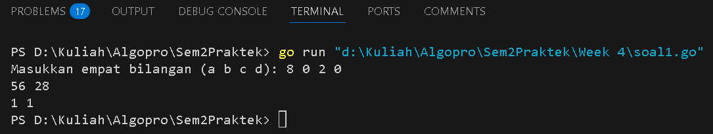
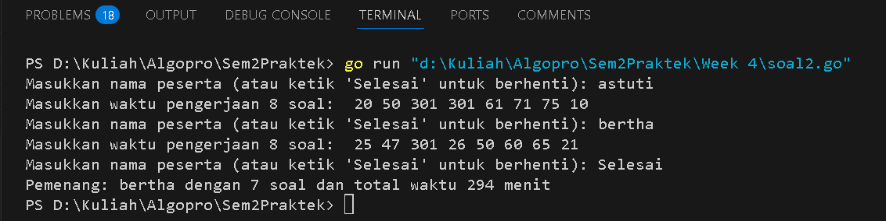
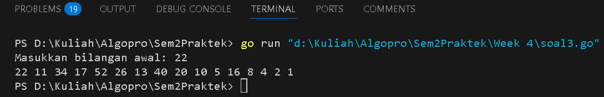

<h1 align="center">Laporan Praktikum Modul 4</h1>
<p align="center">Balawan Satria Lhaksana Putra Mazzimo - 103112430004</p>


## Dasar Teori
Prosedur adalah subprogram yang terdiri dari beberapa instruksi program yang dibuat untuk mengurangi kompleksitas kode dan meningkatkan keterbacaan. Berbeda dengan fungsi, prosedur tidak mengembalikan nilai tetapi menghasilkan efek langsung pada program saat dipanggil.

#### Soal 1

> Minggu ini, mahasiswa Fakultas Informatika mendapatkan tugas dari mata kuliah matematika diskrit untuk mempelajari kombinasi dan permutasi. Jonas salah seorang mahasiswa, iseng untuk mengimplementasikannya ke dalam suatu program. Oleh karena itu bersediakah kalian membantu Jonas?
> - Masukan terdiri dari empat buah bilangan asli 𝑎, 𝑏, 𝑐, dan 𝑑 yang dipisahkan oleh spasi, dengan syarat 𝑎 ≥ 𝑐 dan 𝑏 ≥ 𝑑.
> - Keluaran terdiri dari dua baris. Baris pertama adalah hasil permutasi dan kombinasi 𝒂 terhadap 𝑐, sedangkan baris kedua adalah hasil permutasi dan kombinasi 𝑏 terhadap 𝑑.

```go
package main

import (
	"fmt"
)

// Prosedur untuk menghitung faktorial
func factorial(n int, hasil *int) {
	*hasil = 1
	for i := 2; i <= n; i++ {
		*hasil *= i
	}
}

// Prosedur untuk menghitung permutasi P(n, r) = n! / (n-r)!
func permutation(n, r int, hasil *int) {
	if n < r {
		*hasil = 0
		return
	}
	var fn, fnr int
	factorial(n, &fn)
	factorial(n-r, &fnr)
	*hasil = fn / fnr
}

// Prosedur untuk menghitung kombinasi C(n, r) = n! / (r!(n-r)!)
func combination(n, r int, hasil *int) {
	if n < r {
		*hasil = 0
		return
	}
	var fn, fr, fnr int
	factorial(n, &fn)
	factorial(r, &fr)
	factorial(n-r, &fnr)
	*hasil = fn / (fr * fnr)
}

func main() {
	var a, b, c, d int
	var permA, combA, permB, combB int

	// Meminta input dari pengguna
	fmt.Print("Masukkan empat bilangan (a b c d): ")
	fmt.Scan(&a, &b, &c, &d)

	// Validasi input
	if a >= c && b >= d {
		permutation(a, c, &permA)
		combination(a, c, &combA)
		permutation(b, d, &permB)
		combination(b, d, &combB)
		
		// Menampilkan hasil
		fmt.Println(permA, combA)
		fmt.Println(permB, combB)
	} else {
		fmt.Println("Input tidak valid: Pastikan a >= c dan b >= d")
	}
}
```
Hasil :

**Deskripsi :**
Program ini menghitung nilai **permutasi** dan **kombinasi** dari dua pasang bilangan berdasarkan input yang diberikan oleh pengguna. Pengguna harus memasukkan empat bilangan bulat **a, b, c, dan d** dengan syarat **a ≥ c** dan **b ≥ d**.
Setelah menerima input, program akan menggunakan **prosedur** untuk menghitung:
- **Faktorial (n!)** menggunakan prosedur factorial.
- **Permutasi** dengan rumus **P(n, r) = n! / (n-r)!** menggunakan prosedur `permutation`.
- **Kombinasi** dengan rumus **C(n, r) = n! / (r!(n-r)!)** menggunakan prosedur `combination`.
Program akan mencetak dua baris output:
1. Baris pertama adalah hasil **permutasi dan kombinasi** dari **a terhadap c**.
2. Baris kedua adalah hasil **permutasi dan kombinasi** dari **b terhadap d**.
Jika input tidak memenuhi syarat **a ≥ c** dan **b ≥ d**, program akan menampilkan pesan error.
#### Soal 2

>Kompetisi pemrograman tingkat nasional berlangsung ketat. Setiap peserta diberikan 8 soal yang harus dapat diselesaikan dalam waktu 5 jam saja. Peserta yang berhasil menyelesaikan soal paling banyak dalam waktu paling singkat adalah pemenangnya. 
>- Buat program gema yang mencari pemenang dari daftar peserta yang diberikan. Program harus dibuat modular, yaitu dengan membuat prosedur hitungSkor yang mengembalikan total soal dan total skor yang dikerjakan oleh seorang peserta, melalui parameter formal. Pembacaan nama peserta dilakukan di program utama, sedangkan waktu pengerjaan dibaca di dalam prosedur.
>- Setiap baris masukan dimulai dengan satu string nama peserta tersebut diikuti dengan adalah 8 integer yang menyatakan berapa lama (dalam menit) peserta tersebut menyelesaikan soal. Jika tidak berhasil atau tidak mengirimkan jawaban maka otomatis dianggap menyelesaikan dalam waktu 5 jam 1 menit (301 menit). 
>- Satu baris keluaran berisi nama pemenang, jumlah soal yang diselesaikan, dan nilai yang diperoleh. Nilai adalah total waktu yang dibutuhkan untuk menyelesaikan soal yang berhasil diselesaikan.

```go
package main

import (
	"fmt"
)

// Prosedur untuk membaca waktu pengerjaan dan menghitung skor
func hitungSkor(soal *int, totalWaktu *int) {
	var waktu [8]int
	*soal = 0
	*totalWaktu = 0

	// Meminta input waktu pengerjaan di dalam prosedur
	fmt.Print("Masukkan waktu pengerjaan 8 soal: ")
	for i := 0; i < 8; i++ {
		fmt.Scan(&waktu[i])
	}

	// Menghitung jumlah soal yang diselesaikan dan total waktu
	for i := 0; i < 8; i++ {
		if waktu[i] <= 300 { // Jika waktu ≤ 300, soal dianggap dikerjakan
			*soal++
			*totalWaktu += waktu[i]
		}
	}
}

func main() {
	var nama, pemenang string
	var soal, totalWaktu int
	var maxSoal, minWaktu int

	maxSoal = 0
	minWaktu = 99999 // Angka besar sebagai batas awal

	for {
		fmt.Print("Masukkan nama peserta (atau ketik 'Selesai' untuk berhenti): ")
		fmt.Scan(&nama)
		if nama == "Selesai" {
			break
		}

		// Memanggil prosedur untuk membaca waktu dan menghitung skor
		hitungSkor(&soal, &totalWaktu)

		// Menentukan pemenang berdasarkan aturan
		if soal > maxSoal || (soal == maxSoal && totalWaktu < minWaktu) {
			maxSoal = soal
			minWaktu = totalWaktu
			pemenang = nama
		}
	}

	// Menampilkan pemenang
	fmt.Println("Pemenang:", pemenang, "dengan", maxSoal, "soal dan total waktu", minWaktu, "menit")
}
```
Hasil :

**Deskripsi :**
Program ini bertujuan untuk menentukan **pemenang kompetisi pemrograman** berdasarkan jumlah soal yang berhasil diselesaikan dan total waktu pengerjaan. Setiap peserta memiliki 8 soal untuk diselesaikan dalam **5 jam (300 menit)**, jika tidak mengerjakan atau tidak mengirim jawaban, maka soal dianggap dikerjakan dalam **301 menit**.
**Aturan pemenang :**
1. Peserta dengan jumlah soal terselesaikan terbanyak menang.
2. Jika jumlah soal sama, peserta dengan total waktu terkecil menang.
#### Soal 3

>Skiena dan Revilla dalam Programming Challenges mendefinisikan sebuah deret bilangan. Deret dimulai dengan sebuah bilangan bulat n. Jika bilangan n saat itu genap, maka suku berikutnya adalah ½n, tetapi jika ganjil maka suku berikutnya bernilai 3n+1. Rumus yang sama digunakan terus menerus untuk mencari suku berikutnya. Deret berakhir ketika suku terakhir Halaman 9 | M o d u l P r a k t i k u m A l g o r i t m a P e m r o g r a m a n bernilai 1. Sebagai contoh jika dimulai dengan n=22, maka deret bilangan yang diperoleh adalah: 22 11 34 17 52 26 13 40 20 10 5 16 8 4 2 1 Untuk suku awal sampai dengan 1000000, diketahui deret selalu mencapai suku dengan nilai 1. Buat program skiena yang akan mencetak setiap suku dari deret yang dijelaskan di atas untuk nilai suku awal yang diberikan. Pencetakan deret harus dibuat dalam prosedur cetakDeret yang mempunyai 1 parameter formal, yaitu nilai dari suku awal. prosedure cetakDeret(in n : integer ) Masukan berupa satu bilangan integer positif yang lebih kecil dari 1000000. Keluaran terdiri dari satu baris saja. Setiap suku dari deret tersebut dicetak dalam baris yang dan dipisahkan oleh sebuah spasi.

```go
package main

import (
	"fmt"
)

// Prosedur untuk mencetak deret bilangan sampai mencapai 1
func cetakDeret(n int) {
	for n != 1 {
		fmt.Print(n, " ") // Mencetak angka saat ini
		if n%2 == 0 {
			n = n / 2 // Jika genap, bagi 2
		} else {
			n = 3*n + 1 // Jika ganjil, kalikan 3 dan tambah 1
		}
	}
	fmt.Println(n) // Cetak angka 1 sebagai akhir deret
}

func main() {
	var n int
	fmt.Print("Masukkan bilangan awal: ")
	fmt.Scan(&n)

	// Validasi input harus lebih kecil dari 1.000.000
	if n <= 0 || n >= 1000000 {
		fmt.Println("Input harus bilangan positif dan kurang dari 1.000.000")
		return
	}

	// Memanggil prosedur untuk mencetak deret
	cetakDeret(n)
}
```
Hasil :

Deskripsi :
Program ini menghasilkan deret bilangan berdasarkan aturan:
- Jika bilangan saat ini **n** genap, maka suku berikutnya adalah **n / 2**.
- Jika bilangan saat ini **n** ganjil, maka suku berikutnya adalah **3n + 1**.
- Deret akan berakhir ketika mencapai angka **1**.


