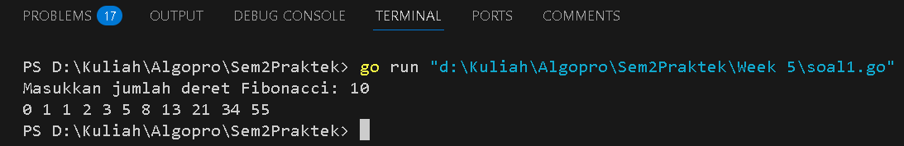
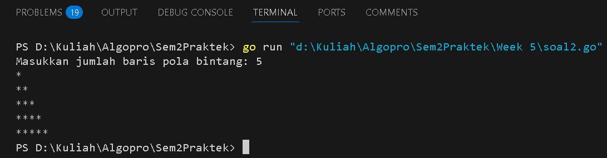
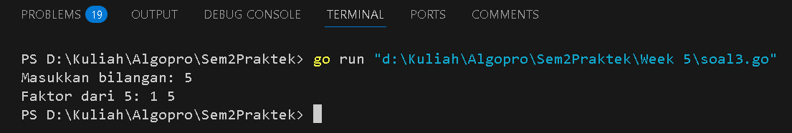
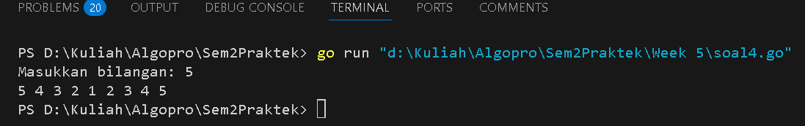
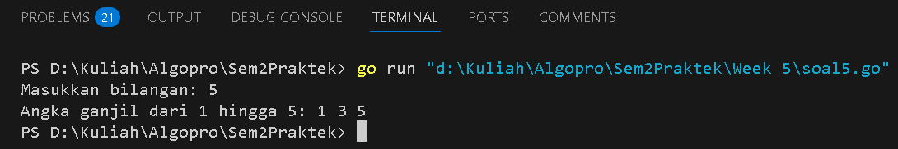

<h1 align="center">Laporan Praktikum Modul 5</h1>
<p align="center">Balawan Satria Lhaksana Putra Mazzimo - 103112430004</p>


## Dasar Teori
Rekursif adalah teknik pemrograman di mana sebuah fungsi atau prosedur memanggil dirinya sendiri untuk menyelesaikan masalah secara bertahap. Dalam rekursi, terdapat dua komponen utama, yaitu **base-case**, yang berfungsi sebagai kondisi penghentian agar rekursi tidak berjalan tanpa henti, serta **recursive-case**, yaitu bagian di mana fungsi memanggil dirinya sendiri hingga mencapai base-case.

#### Soal 1

> Deret fibonacci adalah sebuah deret dengan nilai suku ke-0 dan ke-1 adalah 0 dan 1, dan nilai suku ke-n selanjutnya adalah hasil penjumlahan dua suku sebelumnya. Secara umum dapat diformulasikan 𝑆𝑛 = 𝑆𝑛−1 + 𝑆𝑛−2 . Berikut ini adalah contoh nilai deret fibonacci hingga suku ke-10. Buatlah program yang mengimplementasikan fungsi rekursif pada deret fibonacci tersebut.

```go
package main

import "fmt"

// Fungsi untuk menghitung bilangan Fibonacci secara rekursif
func fibonacci(n int) int {
	if n < 2 {
		return n
	}
	return fibonacci(n-1) + fibonacci(n-2)
}

// Fungsi rekursif untuk mencetak deret Fibonacci tanpa menggunakan return
func cetakFibonacci(i, n int) {
	fmt.Print(fibonacci(i), " ")
	if i < n {
		cetakFibonacci(i+1, n)
	}
}

func main() {
	var n int
	fmt.Print("Masukkan jumlah deret Fibonacci: ")
	fmt.Scan(&n)
	cetakFibonacci(0, n)
}
```
Hasil :

**Deskripsi :**
Program ini dibuat untuk mencetak deret Fibonacci menggunakan rekursi dalam bahasa Go. Deret Fibonacci adalah sebuah urutan angka di mana setiap angka merupakan hasil penjumlahan dua angka sebelumnya, dengan dua angka pertama yaitu `0` dan `1`.
Program ini memiliki dua fungsi utama:
1. **Fungsi `fibonacci(n int) int`**
    - Menghitung bilangan Fibonacci ke-`n` secara rekursif.
    - Jika `n < 2`, langsung mengembalikan `n` sebagai nilai dasar.
    - Jika `n ≥ 2`, nilai Fibonacci dihitung dengan menjumlahkan Fibonacci `n-1` dan `n-2`.
2. **Fungsi `cetakFibonacci(i, n int)`**
    - Mencetak bilangan Fibonacci dari indeks `0` hingga `n-1` menggunakan rekursi.
    - Memanggil fungsi `fibonacci(i)` untuk mendapatkan nilai Fibonacci pada indeks `i`.
    - Jika `i < n`, fungsi akan memanggil dirinya sendiri (`cetakFibonacci(i+1, n)`) hingga mencapai batas `n`.
3. **Fungsi `main()`**
    - Meminta pengguna memasukkan jumlah suku Fibonacci yang ingin ditampilkan.
    - Memanggil fungsi `cetakFibonacci(0, n)` untuk mencetak deret Fibonacci hingga suku ke-`n-1`.
#### Soal 2

>Buatlah sebuah program yang digunakan untuk menampilkan pola bintang berikut ini dengan menggunakan fungsi rekursif. N adalah masukan dari user.

```go
package main

import "fmt"

// Fungsi rekursif untuk mencetak bintang sebanyak n
func cetakBintang(n int) {
	if n > 0 {
		fmt.Print("*")
		cetakBintang(n - 1)
	}
}

// Fungsi rekursif untuk mencetak pola segitiga
func cetakPola(n, baris int) {
	if baris <= n {
		cetakBintang(baris)
		fmt.Println()
		cetakPola(n, baris+1)
	}
}

func main() {
	var n int
	fmt.Print("Masukkan jumlah baris pola bintang: ")
	fmt.Scan(&n)
	cetakPola(n, 1)
}
```
Hasil :

**Deskripsi :**
Program ini menggunakan rekursi untuk mencetak pola segitiga bintang dengan jumlah baris yang ditentukan oleh pengguna. Terdapat dua fungsi utama dalam program ini:
1. **Fungsi `cetakBintang(n int)`**
    - Fungsi rekursif yang mencetak `n` bintang dalam satu baris.
    - Jika `n > 0`, program mencetak satu bintang (`*`) lalu memanggil dirinya sendiri dengan `n-1` hingga `n` menjadi nol.
2. **Fungsi `cetakPola(n, baris int)`**
    - Fungsi rekursif untuk mencetak pola segitiga.
    - Memanggil `cetakBintang(baris)` untuk mencetak bintang sesuai jumlah baris saat ini.
    - Menambahkan baris baru (`fmt.Println()`) setelah pencetakan bintang selesai.
    - Memanggil dirinya sendiri dengan `baris+1` hingga mencapai `n`, sehingga membentuk pola bertingkat.
3. **Fungsi `main()`**
    - Meminta pengguna memasukkan jumlah baris pola bintang.
    - Memanggil `cetakPola(n, 1)` untuk mencetak pola bintang mulai dari satu bintang hingga `n` bintang di baris terakhir.
#### Soal 3

>Buatlah program yang mengimplementasikan rekursif untuk menampilkan faktor bilangan dari suatu N, atau bilangan yang apa saja yang habis membagi N. Masukan terdiri dari sebuah bilangan bulat positif N. Keluaran terdiri dari barisan bilangan yang menjadi faktor dari N (terurut dari 1 hingga N ya).

```go
package main

import "fmt"

// Fungsi rekursif untuk mencetak faktor dari bilangan n
func cetakFaktor(n, i int) {
	if i <= n {
		if n%i == 0 {
			fmt.Print(i, " ")
		}
		cetakFaktor(n, i+1)
	}
}

func main() {
	var n int
	fmt.Print("Masukkan bilangan: ")
		fmt.Scan(&n)
	fmt.Print("Faktor dari ", n, ": ")
	cetakFaktor(n, 1)
	fmt.Println() 
}
```
Hasil :

Deskripsi :
Program ini menggunakan rekursi untuk mencetak faktor dari bilangan yang dimasukkan oleh pengguna. Terdapat dua fungsi utama dalam program ini:
1. Fungsi `cetakFaktor(n, i int)`
	- Fungsi rekursif yang mencetak faktor dari bilangan `n`.
	- Jika `i <= n`, program akan memeriksa apakah `n % i == 0`. Jika benar, maka `i` dicetak sebagai faktor dari `n`.
	- Setelah itu, fungsi akan memanggil dirinya sendiri dengan `i+1`, terus menerus hingga nilai `i` lebih besar dari `n`.
2. Fungsi `main()`
	- Meminta pengguna untuk memasukkan sebuah bilangan integer (`n`).
	- Program kemudian mencetak teks "Faktor dari n:".
	- Fungsi `cetakFaktor(n, 1)` dipanggil untuk memulai pencarian faktor dari bilangan `n`, dimulai dari `i = 1` hingga nilai `i` mencapai `n`.
	- Setelah semua faktor dicetak, program selesai.
#### Soal 4

>Buatlah program yang mengimplementasikan rekursif untuk menampilkan barisan bilangan tertentu. Masukan terdiri dari sebuah bilangan bulat positif N. Keluaran terdiri dari barisan bilangan dari N hingga 1 dan kembali ke N.

```go
package main

import "fmt"

// Fungsi barisan digunakan untuk mencetak angka dari n-1 kemudian ke n lagi
func barisan(n, angka int) {
	// Mencetak angka
	fmt.Print(angka, " ")
	
	// Jika angka lebih besar dari 1, panggil fungsi rekursif dengan angka-1
	if angka > 1 {
		barisan(n, angka-1)
		// Mencetak angka setelah rekursi (untuk pola simetris)
		fmt.Print(angka, " ")
	}
}

func main() {
	var n int
	
	// Meminta input dari pengguna
	fmt.Print("Masukkan bilangan: ")
	fmt.Scan(&n)
	barisan(n, n)
	fmt.Println()
}
```
Hasil :

Deskripsi :
Program ini menggunakan rekursi untuk mencetak pola angka dari bilangan yang dimasukkan oleh pengguna. Terdapat dua fungsi utama dalam program ini:
1. **Fungsi `barisan(n, angka int)`**
    - Fungsi rekursif yang mencetak angka dalam urutan menurun dari `n` ke 1, kemudian kembali lagi ke `n`.
    - Jika `angka > 1`, program akan memanggil dirinya sendiri dengan `angka-1` untuk mencetak angka yang lebih kecil.
    - Setelah mencapai angka 1, fungsi akan kembali dan mencetak angka yang lebih besar secara simetris, membentuk pola angka bertingkat.
2. **Fungsi `main()`**
    - Meminta pengguna untuk memasukkan sebuah bilangan integer (`n`).
    - Program kemudian mencetak teks "Masukkan bilangan: ".
    - Fungsi `barisan(n, n)` dipanggil untuk memulai pencetakan angka, dimulai dari `n`, menurun hingga 1, kemudian kembali lagi ke `n`.
    - Setelah semua angka dicetak, program selesai.
#### Soal 5

>Buatlah program yang mengimplementasikan rekursif untuk menampilkan barisan bilangan ganjil. Masukan terdiri dari sebuah bilangan bulat positif N. Keluaran terdiri dari barisan bilangan ganjil dari 1 hingga N. Contoh masukan dan keluaran:

```go
package main

import "fmt"

// Prosedur untuk mencetak angka ganjil dari 1 hingga n
func cetakGanjil(i, n int) {
	if i <= n {
		fmt.Print(i, " ") // Mencetak angka ganjil
		cetakGanjil(i+2, n) // Rekursi dengan angka ganjil berikutnya
	}
}

func main() {
	var n int
	fmt.Print("Masukkan bilangan: ") 
	fmt.Scan(&n) 
	fmt.Print("Angka ganjil dari 1 hingga ", n, ": ")
	cetakGanjil(1, n) 
	fmt.Println() 
}
```
Hasil :

Deskripsi :
Program ini menggunakan rekursi untuk mencetak angka ganjil dari 1 hingga `n` yang dimasukkan oleh pengguna. Terdapat dua fungsi utama dalam program ini:
1. **Fungsi `cetakGanjil(i, n int)`**
    - Fungsi rekursif yang mencetak angka ganjil mulai dari `i` hingga `n`.
    - Jika `i <= n`, program akan mencetak angka `i` yang merupakan angka ganjil dan kemudian memanggil dirinya sendiri dengan `i+2` untuk melanjutkan ke angka ganjil berikutnya.
    - Proses ini akan terus berulang hingga angka `i` melebihi `n`.
2. **Fungsi `main()`**
    - Meminta pengguna untuk memasukkan sebuah bilangan integer (`n`) dengan menggunakan `fmt.Scan(&n)`.
    - Program kemudian mencetak teks "Angka ganjil dari 1 hingga n: " sebagai penjelasan.
    - Fungsi `cetakGanjil(1, n)` dipanggil untuk memulai pencetakan angka ganjil mulai dari 1 hingga `n`.
    - Setelah semua angka ganjil dicetak, program selesai dengan mencetak baris baru menggunakan `fmt.Println()`.