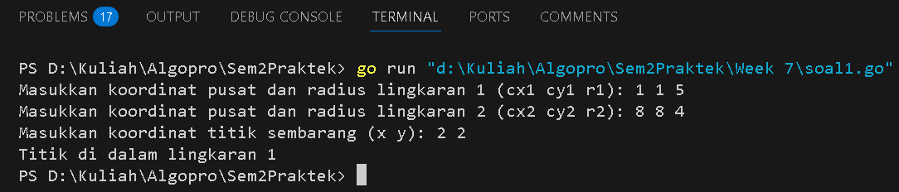
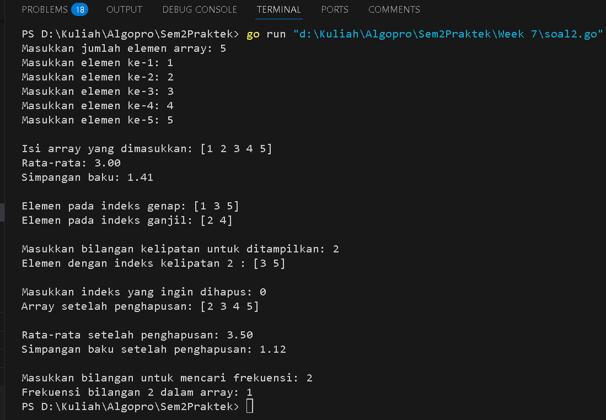
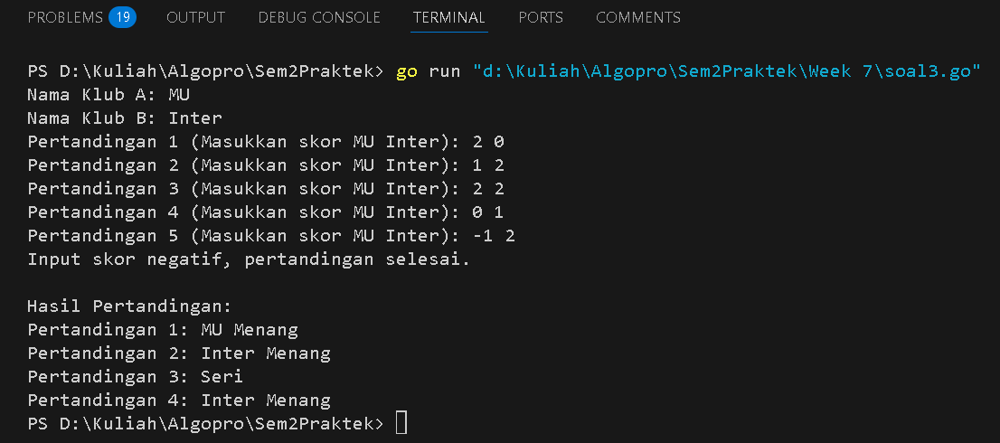
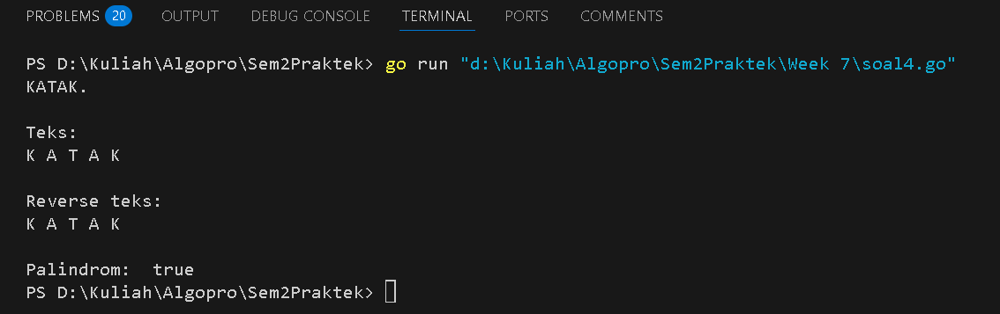

<h1 align="center">Laporan Praktikum Modul 7</h1>
<p align="center">Balawan Satria Lhaksana Putra Mazzimo - 103112430004</p>


## Dasar Teori
Struktur (struct) adalah kumpulan variabel dengan tipe data berbeda dalam satu objek, sedangkan array adalah kumpulan elemen bertipe sama yang diakses melalui indeks. Penggabungan keduanya memungkinkan penyimpanan dan pengelolaan data kompleks, seperti daftar mahasiswa atau karyawan, secara lebih terorganisir dan efisien.

#### Soal 1

> Suatu lingkaran didefinisikan dengan koordinat titik pusat (𝑐𝑥, 𝑐𝑦) dengan radius 𝑟. Apabila diberikan dua buah lingkaran, maka tentukan posisi sebuah titik sembarang (𝑥, 𝑦) berdasarkan dua lingkaran tersebut. Gunakan tipe bentukan titik untuk menyimpan koordinat, dan tipe bentukan lingkaran untuk menyimpan titik pusat lingkaran dan radiusnya. Masukan terdiri dari beberapa tiga baris. Baris pertama dan kedua adalah koordinat titik pusat dan radius dari lingkaran 1 dan lingkaran 2, sedangkan baris ketiga adalah koordinat titik sembarang. Asumsi sumbu x dan y dari semua titik dan juga radius direpresentasikan dengan bilangan bulat. Keluaran berupa string yang menyatakan posisi titik "Titik di dalam lingkaran 1 dan 2", "Titik di dalam lingkaran 1", "Titik di dalam lingkaran 2", atau "Titik di luar lingkaran 1 dan 2".

```go
package main

import (
	"fmt"
	"math"
)

// Struktur untuk merepresentasikan titik
type Titik struct {
	x, y int
}

// Struktur untuk merepresentasikan lingkaran
type Lingkaran struct {
	pusat  Titik
	radius int
}

// Fungsi untuk menghitung jarak antara dua titik
func jarak(a, b Titik) float64 {
	return math.Sqrt(math.Pow(float64(a.x-b.x), 2) + math.Pow(float64(a.y-b.y), 2))
}

// Fungsi untuk mengecek apakah titik berada di dalam lingkaran
func didalam(l Lingkaran, p Titik) bool {
	return jarak(l.pusat, p) <= float64(l.radius)
}

func main() {
	var l1, l2 Lingkaran
	var p Titik

	// Input untuk lingkaran 1
	fmt.Print("Masukkan koordinat pusat dan radius lingkaran 1 (cx1 cy1 r1): ")
	fmt.Scan(&l1.pusat.x, &l1.pusat.y, &l1.radius)

	// Input untuk lingkaran 2
	fmt.Print("Masukkan koordinat pusat dan radius lingkaran 2 (cx2 cy2 r2): ")
	fmt.Scan(&l2.pusat.x, &l2.pusat.y, &l2.radius)

	// Input untuk titik sembarang
	fmt.Print("Masukkan koordinat titik sembarang (x y): ")
	fmt.Scan(&p.x, &p.y)

	// Mengecek posisi titik
didalam1 := didalam(l1, p)
didalam2 := didalam(l2, p)

	// Menentukan keluaran
	if didalam1 && didalam2 {
		fmt.Println("Titik di dalam lingkaran 1 dan 2")
	} else if didalam1 {
		fmt.Println("Titik di dalam lingkaran 1")
	} else if didalam2 {
		fmt.Println("Titik di dalam lingkaran 2")
	} else {
		fmt.Println("Titik di luar lingkaran 1 dan 2")
	}
}
```
Hasil :

**Deskripsi :**
Program ini menentukan posisi sebuah titik terhadap dua lingkaran menggunakan struktur `Titik` untuk menyimpan koordinat dan `Lingkaran` untuk menyimpan pusat serta radius lingkaran. Fungsi `jarak` menghitung jarak antara dua titik dengan rumus Euclidean, sedangkan fungsi `didalam` mengecek apakah titik berada di dalam lingkaran dengan membandingkan jaraknya terhadap radius. Program meminta input koordinat pusat dan radius untuk dua lingkaran serta koordinat titik yang akan dicek. Berdasarkan hasil perhitungan, program mencetak apakah titik berada di dalam kedua lingkaran, hanya di dalam salah satu lingkaran, atau di luar keduanya.
#### Soal 2

>Sebuah array digunakan untuk menampung sekumpulan bilangan bulat. Buatlah program yang digunakan untuk mengisi array tersebut sebanyak N elemen nilai. Asumsikan array memiliki kapasitas penyimpanan data sejumlah elemen tertentu. Program dapat menampilkan beberapa informasi berikut: 
>	a. Menampilkan keseluruhan isi dari array. 
>	b. Menampilkan elemen-elemen array dengan indeks ganjil saja. 
>	c. Menampilkan elemen-elemen array dengan indeks genap saja (asumsi indek ke-0 adalah genap). 
>	d. Menampilkan elemen-elemen array dengan indeks kelipatan bilangan x. x bisa diperoleh dari masukan pengguna. 
>	e. Menghapus elemen array pada indeks tertentu, asumsi indeks yang hapus selalu valid. Tampilkan keseluruhan isi dari arraynya, pastikan data yang dihapus tidak tampil 
>	f. Menampilkan rata-rata dari bilangan yang ada di dalam array. 
>	g. Menampilkan standar deviasi atau simpangan baku dari bilangan yang ada di dalam array tersebut. 
>	h. Menampilkan frekuensi dari suatu bilangan tertentu di dalam array yang telah diisi tersebut.

```go
package main

import (
	"fmt"
	"math"
)

// Fungsi untuk mengisi array berdasarkan jumlah input
func isiArray(jumlah int) []int {
	array := make([]int, jumlah)
	for i := 0; i < jumlah; i++ {
		fmt.Printf("Masukkan elemen ke-%d: ", i+1)
		fmt.Scan(&array[i])
	}
	return array
}

// Mengelompokkan elemen berdasarkan indeks genap dan ganjil
func ganjilGenap(array []int) ([]int, []int) {
	var genap, ganjil []int
	for i, val := range array {
		if i%2 == 0 {
			genap = append(genap, val)
		} else {
			ganjil = append(ganjil, val)
		}
	}
	return genap, ganjil
}

// Mengembalikan elemen dengan indeks kelipatan bilangan tertentu
func kelipatan(array []int, bilangan int) []int {
	if bilangan <= 0 {
		fmt.Println("Bilangan kelipatan harus lebih dari 0.")
		return nil
	}
	var hasil []int
	for i := bilangan; i < len(array); i += bilangan {
		hasil = append(hasil, array[i])
	}
	return hasil
}

// Menghapus elemen berdasarkan indeks dengan validasi
func hapusIndeks(array []int, indeks int) []int {
	if indeks < 0 || indeks >= len(array) {
		fmt.Println("Indeks tidak valid, tidak ada perubahan pada array.")
		return array
	}
	return append(array[:indeks], array[indeks+1:]...)
}

// Menghitung rata-rata array
func rataRata(array []int) float64 {
	if len(array) == 0 {
		return 0
	}
	total := 0
	for _, val := range array {
		total += val
	}
	return float64(total) / float64(len(array))
}

// Menghitung simpangan baku array
func simpanganBaku(array []int) float64 {
	if len(array) == 0 {
		return 0
	}
	rata := rataRata(array)
	var jumlah float64
	for _, val := range array {
		jumlah += math.Pow(float64(val)-rata, 2)
	}
	return math.Sqrt(jumlah / float64(len(array)))
}

// Menghitung jumlah kemunculan angka dalam array
func frekuensi(array []int, angka int) int {
	jumlah := 0
	for _, val := range array {
		if val == angka {
			jumlah++
		}
	}
	return jumlah
}

func main() {
	var jumlah, bilangan, indeks, angka int

	// Input jumlah elemen array
	fmt.Print("Masukkan jumlah elemen array: ")
	fmt.Scan(&jumlah)

	if jumlah <= 0 {
		fmt.Println("Jumlah elemen harus lebih dari 0. Program dihentikan.")
		return
	}

	// Memasukkan elemen ke dalam array
	array := isiArray(jumlah)

	// Menampilkan isi array dan statistik awal
	fmt.Println("\nIsi array yang dimasukkan:", array)
	fmt.Printf("Rata-rata: %.2f\n", rataRata(array))
	fmt.Printf("Simpangan baku: %.2f\n", simpanganBaku(array))

	// Mengelompokkan elemen berdasarkan indeks genap dan ganjil
	genap, ganjil := ganjilGenap(array)
	fmt.Println("\nElemen pada indeks genap:", genap)
	fmt.Println("Elemen pada indeks ganjil:", ganjil)

	// Menampilkan elemen berdasarkan indeks kelipatan
	fmt.Print("\nMasukkan bilangan kelipatan untuk ditampilkan: ")
	fmt.Scan(&bilangan)
	hasilKelipatan := kelipatan(array, bilangan)
	if hasilKelipatan != nil {
		fmt.Println("Elemen dengan indeks kelipatan", bilangan, ":", hasilKelipatan)
	}

	// Menghapus elemen berdasarkan indeks
	fmt.Print("\nMasukkan indeks yang ingin dihapus: ")
	fmt.Scan(&indeks)
	array = hapusIndeks(array, indeks)
	fmt.Println("Array setelah penghapusan:", array)

	// Cek apakah array kosong setelah penghapusan sebelum menghitung statistik
	if len(array) > 0 {
		fmt.Printf("\nRata-rata setelah penghapusan: %.2f\n", rataRata(array))
		fmt.Printf("Simpangan baku setelah penghapusan: %.2f\n", simpanganBaku(array))
	} else {
		fmt.Println("\nArray kosong setelah penghapusan.")
	}

	// Menghitung frekuensi kemunculan angka dalam array
	fmt.Print("\nMasukkan bilangan untuk mencari frekuensi: ")
	fmt.Scan(&angka)
	fmt.Printf("Frekuensi bilangan %d dalam array: %d\n", angka, frekuensi(array, angka))
}
```
Hasil :

**Deskripsi :**
Program ini mengelola array dalam bahasa Go dengan berbagai operasi, seperti memasukkan elemen, menghitung rata-rata dan simpangan baku, serta mengelompokkan elemen berdasarkan indeks genap dan ganjil. Selain itu, program dapat menampilkan elemen dengan indeks kelipatan tertentu, menghapus elemen berdasarkan indeks dengan validasi agar tidak terjadi error, serta menghitung frekuensi kemunculan angka dalam array. Dilengkapi dengan validasi input dan format output yang rapi, program ini memastikan proses berjalan dengan aman dan mudah dipahami.
#### Soal 3

>Sebuah program digunakan untuk menyimpan dan menampilkan nama-nama klub yang memenangkan pertandingan bola pada suatu grup pertandingan. Buatlah program yang digunakan untuk merekap skor pertandingan bola 2 buah klub bola yang berlaga. Pertama-tama program meminta masukan nama-nama klub yang bertanding, kemudian program meminta masukan skor hasil pertandingan kedua klub tersebut. Yang disimpan dalam array adalah nama-nama klub yang menang saja. Proses input skor berhenti ketika skor salah satu atau kedua klub tidak valid (negatif). Di akhir program, tampilkan daftar klub yang memenangkan pertandingan. 

```go
package main

import "fmt"

func main() {
	var klubA, klubB string
	var skorA, skorB int
	var hasil []string

	// Input nama klub
	fmt.Print("Nama Klub A: ")
	fmt.Scan(&klubA)
	fmt.Print("Nama Klub B: ")
	fmt.Scan(&klubB)

	pertandingan := 1
	for {
		fmt.Printf("Pertandingan %d (Masukkan skor %s %s): ", pertandingan, klubA, klubB)
		fmt.Scan(&skorA, &skorB)

		// Jika skor negatif, keluar dari loop
		if skorA < 0 || skorB < 0 {
			fmt.Println("Input skor negatif, pertandingan selesai.\n")
			break
		}

		// Menentukan pemenang dan menyimpannya dalam slice hasil
		if skorA > skorB {
			hasil = append(hasil, fmt.Sprintf("Pertandingan %d: %s Menang", pertandingan, klubA))
		} else if skorA < skorB {
			hasil = append(hasil, fmt.Sprintf("Pertandingan %d: %s Menang", pertandingan, klubB))
		} else {
			hasil = append(hasil, fmt.Sprintf("Pertandingan %d: Seri", pertandingan))
		}

		pertandingan++
	}

	// Menampilkan hasil semua pertandingan
	if len(hasil) > 0 {
		fmt.Println("Hasil Pertandingan:")
		for _, pemenang := range hasil {
			fmt.Println(pemenang)
		}
	} else {
		fmt.Println("Tidak ada pertandingan yang tercatat.")
	}
}
```
Hasil :

Deskripsi :
Program ini mencatat hasil pertandingan antara dua klub berdasarkan skor yang dimasukkan oleh pengguna. Pengguna diminta untuk memasukkan nama kedua klub, lalu memasukkan skor untuk setiap pertandingan yang berlangsung secara berulang. Jika skor yang dimasukkan negatif, program akan berhenti dan menampilkan semua hasil pertandingan yang telah dicatat. Setiap pertandingan akan dicatat sebagai kemenangan salah satu klub atau hasil seri, dan semua hasil akan ditampilkan setelah program selesai. Program ini memastikan input yang valid dan memberikan output yang jelas serta terstruktur.
#### Soal 4

>Sebuah array digunakan untuk menampung sekumpulan karakter, Anda diminta untuk membuat sebuah subprogram untuk melakukan membalikkan urutan isi array dan memeriksa apakah membentuk palindrom.

```go
package main

import "fmt"

const NMAX int = 127
type tabel [NMAX]rune

func isiArray(t *tabel, n *int) {
	*n = 0
	var c rune
	for *n < NMAX {
		fmt.Scanf("%c", &c)
		if c == '.' {
			break
		}
		t[*n] = c
		*n++
	}
}

func cetakArray(t tabel, n int) {
	for i := 0; i < n; i++ {
		fmt.Printf("%c ", t[i])
	}
	fmt.Println()
}

func balikanArray(t *tabel, n int) {
	for i := 0; i < n/2; i++ {
		t[i], t[n-1-i] = t[n-1-i], t[i]
	}
}

func palindrom(t tabel, n int) bool {
	for i := 0; i < n/2; i++ {
		if t[i] != t[n-1-i] {
			return false
		}
	}
	return true
}

func main() {
	var tab tabel
	var m int

	isiArray(&tab, &m)

	fmt.Println("\nTeks: ")
	cetakArray(tab, m)

	balikanArray(&tab, m)

	fmt.Println("\nReverse teks: ")
	cetakArray(tab, m)

	fmt.Println("\nPalindrom: ", palindrom(tab, m))
}
```
Hasil :

Deskripsi : 
Program ini berfungsi untuk membaca input karakter hingga ditemukan tanda titik (`.`), lalu menyimpannya dalam array. Setelah itu, program mencetak teks yang telah dimasukkan, membalik urutan teks, dan memeriksa apakah teks tersebut merupakan palindrom.
